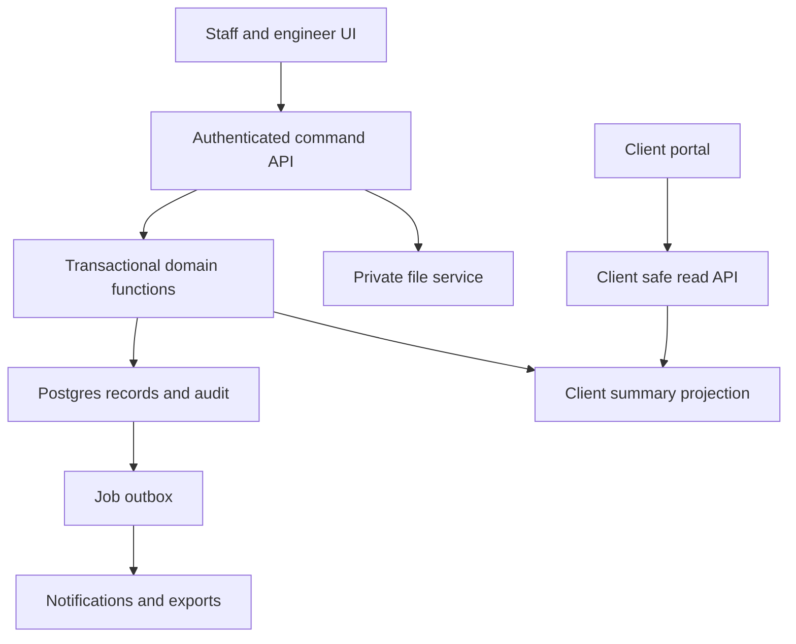
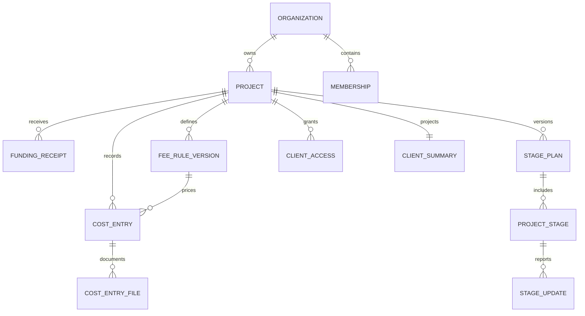
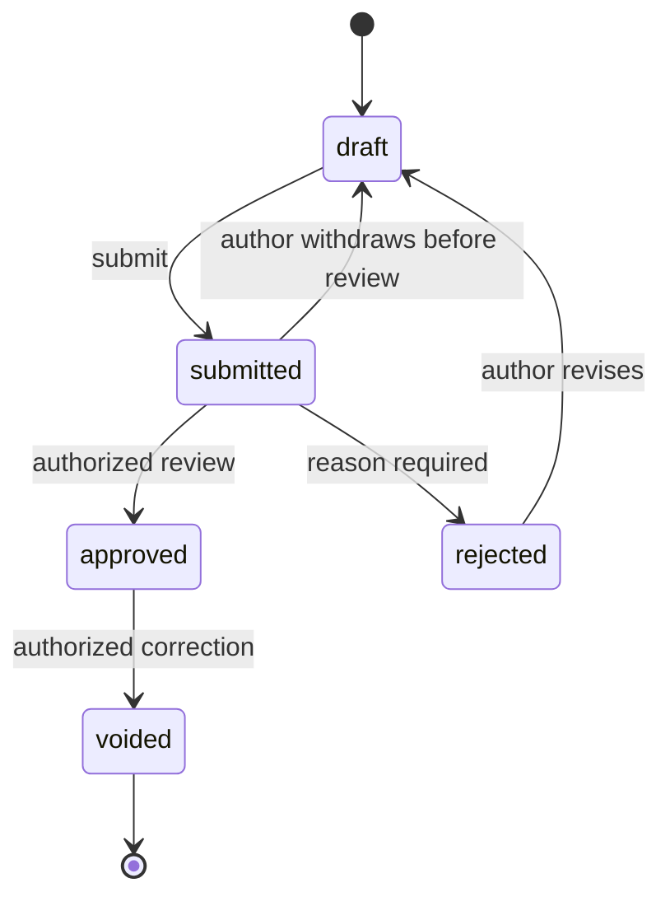
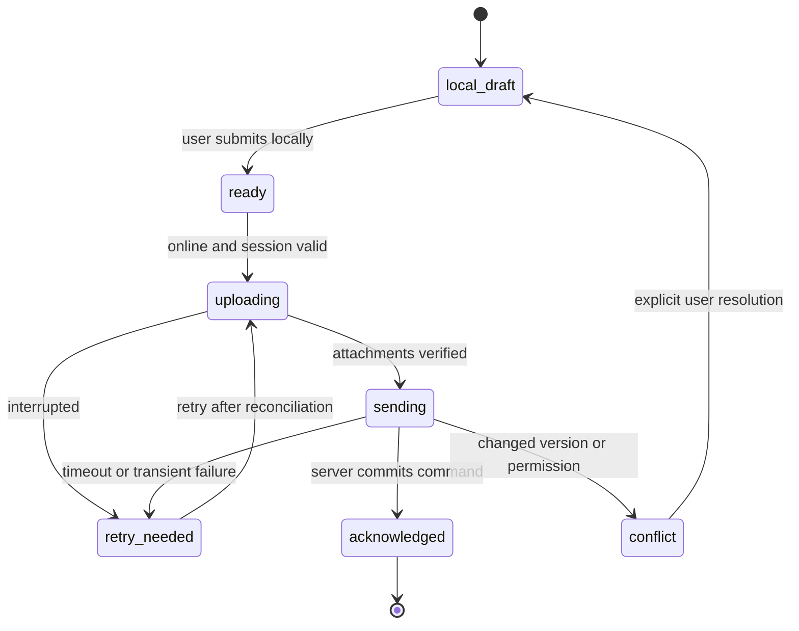
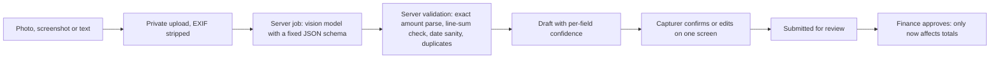

# Studio Project Portal complete system specification

Version 1.0 · 1 October 2026

Repository-ready product, domain, UX, architecture, data, API, security, mobile, migration, delivery and operations specification. This is a proposed build plan, not an implemented or production-validated system. All repository examples are synthetic. Read README.md for usage.

## Contents

1. [Decisions and assumptions](docs/00-decisions.md)
2. [Product scope and requirements](docs/01-product.md)
3. [Financial rules and invariants](docs/02-financial-rules.md)
4. [User experience and visual design](docs/03-ux-design.md)
5. [Technical architecture](docs/04-architecture.md)
6. [Data model and state transitions](docs/05-data-model.md)
7. [API and command contracts](docs/06-api-contracts.md)
8. [Security and permission model](docs/07-security.md)
9. [Mobile and offline specification](docs/08-mobile-offline.md)
10. [Spreadsheet migration and cutover](docs/09-migration.md)
11. [Coding phases and delivery gates](docs/10-coding-phases.md)
12. [Acceptance tests and launch checklist](docs/11-acceptance-tests.md)
13. [SaaS operations and commercial design](docs/12-operations-saas.md)
14. [Evidence assumptions and risk register](docs/13-evidence-risks.md)
15. [AI capture, easy entry and rich presentation](docs/14-ai-capture-and-insights.md)
16. [Screen layouts and interaction contract](design/screen-layouts.md)
17. [First Claude Code prompt](prompts/00-start.md)
18. [Continuing prompts for Claude Code](prompts/phase-prompts.md)


---

Source document: docs/00-decisions.md

# Decisions and assumptions

## What the owner has asked for

The product serves small design and architecture studios running interior fit-out work. It must feel as easy as a spreadsheet for basic staff, support Arabic names and terms without forced translation, allow on-site phone entry, and give clients an attractive graphical project dashboard. It must support each firm's logo. The owner intends to develop it as a SaaS and hand this specification to Claude Code in GitHub.

The worked spreadsheet distinguishes company spending, direct client purchases, client funding payments and an 18 percent management fee. The owner confirmed that the example project's fee applies to both company expenses and direct purchases. This does not establish a universal fee contract for other studios.

The existing project has incomplete dates and documentation and no verified overall budget or physical progress. A migrated total is historical evidence, not proof of correctness. Stage names may remain Stage 1 through Stage 6 until the studio defines its own sequence.

## Proposed defaults that permit implementation

| ID | Decision | Default and rationale | Revisit |
| --- | --- | --- | --- |
| D01 | Initial segment | Small design-and-build or fit-out studios administering client funds | After pilot interviews |
| D02 | Platform | Responsive installable PWA, not native apps at first | If pilots need native capabilities |
| D03 | Language | Arabic default, English switch; original text unchanged | Per organization and user |
| D04 | Currency | EGP for the demo; one currency per project, two-decimal currencies only in MVP | Confirm every imported project |
| D05 | Stack | Next.js and Supabase modular monolith | Phase 0 compatibility review |
| D06 | Fee model | Percentage of eligible paid actuals; organization setup requires an explicit rate; synthetic demo uses 18 percent | Confirm contract per project |
| D07 | Client privacy | Authenticated invitations and explicit project grants; no anonymous sharing | Separate reviewed future feature |
| D08 | Publication | Staff approval feeds current financial aggregates; narrative and photos require publication | Owner may later request snapshots |
| D09 | Stage setup | Six editable unnamed stages, status unknown and progress null; no assumed equal weights | Before useful overall progress |
| D10 | Money precision | BIGINT minor units; basis points for rates; round half away from zero per rule group | Formal finance review |
| D11 | Approval | Finance reviewer or owner approves money; manager or owner publishes site updates | Studio policy pilot |
| D12 | Mobile resilience | Local drafts and explicit foreground sync; no offline approval | Native/offline requirements later |
| D13 | Billing | Manual trial entitlements for pilots; subscription adapter after provider selection | Before charging customers |
| D14 | Project scope | No VAT calculations, statutory invoices, double-entry bookkeeping or FX in MVP | Separate scoped extensions |
| D15 | Import | CSV upload with mapping and preview; no two-way Sheets sync | After migration is proven |
| D16 | Logo and brand | Per-tenant logo and accessible accent; generic SaaS brand separate from pilot firm | Name and identity decision |

## Decisions required before a live pilot

1. Confirm the firm is managing funds on a paid-actuals basis, rather than using accrued invoices or fixed-price revenue recognition.
2. Confirm fee eligibility, treatment of refunds, rate changes and rounding with the firm's contract. The proposed MVP reverses the original fee on eligible refunds.
3. Identify actual reviewers and whether self-approval is permitted. Default: finance staff cannot approve their own submission; owner can override with a reason.
4. Confirm project currency and opening funding/cost history. Do not show a cash proxy as complete until funding, spending and fee withdrawals are attested complete.
5. Choose stage names, approved stage weights and who may publish progress. Progress begins unknown, not not-started or zero.
6. Confirm which photos and budget figures clients may see. Exact financial totals remain inspectable on cards; no hidden ledger is sent to the browser.
7. Approve hosting region, retention policy, privacy terms, email sender and secure support process with appropriate professional review.
8. Approve the data migration reconciliation and cutover date. The previous spreadsheet remains an archive, not a second live source.

## Decisions required before paid launch

Product name and domain; seller legal entity; payment-provider eligibility and settlement country; plan limits and price; tax/invoice responsibilities for the SaaS; customer contract; backup and support commitments. Code must not guess these details or subscribe to paid services on the owner's behalf.

## Scope boundaries

This handoff authorizes a design for a future build, not changes to the live Google Sheet or creation of a GitHub repository. Known risks from the prototype are documented for migration; no live-sheet repair is performed here. Competitor research suggests a focused opportunity, not proof that no competing product exists.

## Owner decisions recorded 1 October 2026

These answers came from the product owner during the specification review. They supersede the matching proposed defaults above. Anything not listed keeps its proposed default.

| ID | Decision | Implementation consequence |
| --- | --- | --- |
| O01 | Generic multi-tenant SaaS from the start. The pilot studio is the first tenant, not a hardcoded identity. | No pilot branding, names or data in code, seeds or fixtures. |
| O02 | Per-studio branding is a core feature, comparable to how general project tools let a workspace present itself to its clients. | MVP: logo, studio display name (Arabic and English), contrast-checked accent, client portal shows the studio brand. Later: studio subdomain, studio email sender, branded PDF summaries. Model the data so these are additive. |
| O03 | Two financial models, delivered in two phases. Phase A: percentage management fee on paid actuals (this specification). Phase B: fixed-price / lump-sum contracts with progress billing, as a separate module after the pilot. | Keep fee logic behind a project `financial_model` boundary so Phase B is an addition, not a rewrite. |
| O04 | The management-fee percentage is editable per project in project settings. | Owner-only settings action creates a new immutable fee-rule version for future approvals; refunds keep their original rule (see financial rules). |
| O05 | Product name is a temporary working name. Do not bake it into code. | One configurable product-name setting; neutral package/identifier names. |
| O06 | Arabic and English with a user switch. Arabic displays Arabic-Indic digits. | `ar` formatting uses the `arab` numbering system for amounts, dates, percentages and chart labels; input accepts both digit sets; CSV/JSON exports always use Western digits. |
| O07 | Typical studio: about four full-time staff (designer, main contractor, accountant, junior) plus project-based talent. | Roles map to owner, manager, finance, engineer. Add a project-only collaborator: assignment-scoped, expiring, capture-only. |
| O08 | Easiest login for now. Later, discourage sharing one account across many devices. | Email + password; owner-generated single-use invite links that can be shared over messaging apps. Record a device identifier on commands/audit now so concurrent-session limits can be added later. Pricing hypothesis: per studio with low-cost field users so sharing saves nothing. |
| O09 | Repository may stay public during the trial; it will go private before commercialisation. | Still no real client data, private appendix or credentials in Git. Licence change is an open owner choice. |
| O10 | Clients may see the calculated management-fee amount. | Shown in the secondary expandable summary of the client portal. |
| O11 | Reordered delivery: Phases 0–4, then a reviewed one-off import of the pilot project, then an online-capture pilot; full offline outbox (Phase 5) and the generic CSV mapping UI follow the pilot. Commitments move to P1; estimates stay. | See the delivery order note in `docs/10-coding-phases.md`. No security or financial gate is relaxed. |

### Specification clarifications accepted with the review

1. A refund inherits payer, fee eligibility, fee-rule version and category from its original cost; it cannot override them.
2. Fee balance requires fee-withdrawal history to be attested complete. Cash proxy requires funding, cost and fee-withdrawal histories all attested complete.
3. A correction's replacement keeps the original cost's fee-rule version.
4. The approval command may adjust category and fee eligibility (audited). Amount or payer changes require rejection.
5. Draft fee eligibility defaults from the project fee rule by payer; only finance or owner may change it.
6. Fee-withdrawal `occurred_on` is nullable with a missing-date flag, like funding receipts.
7. Approving a stage plan offers an explicit, audited "mark remaining stages not started" action. Blocked stages may have null progress.
8. Review screens show the fee-rule group's fee delta, not a per-entry fee.
9. Category cost bars use plain HTML/CSS (native RTL, diverging for refunds); Recharts only for time series with explicit RTL axis handling.
10. Organization creation is operator-gated during the pilot; self-service signup waits for billing.

## Owner decisions recorded 1 October 2026 (second review)

| ID | Decision | Implementation consequence |
| --- | --- | --- |
| O12 | The device/browser language is the default, not Arabic. Supersedes D03 and the Phase 0 "always Arabic" behaviour. | Locale from `Accept-Language`; English when the device is neither Arabic nor English; an explicit switch is remembered in the locale cookie (later: per-user profile preference). |
| O13 | Data entry must be as easy as taking a photo or screenshot. AI reads it (including handwritten Arabic) and prepares the entry; a person confirms. | AI capture moves from P2 (F25 OCR) to P0 as F28. AI output only ever creates a draft for human confirmation, then the normal approval. See `docs/14-ai-capture-and-insights.md`. |
| O14 | Easiest data entry everywhere is a product principle, for site engineers and accountants alike. | Photo-first capture, smart defaults, batch capture, quick text entry, spreadsheet-style draft grid, share-to-app. Each phase's UX gate measures entry effort. |
| O15 | Client presentation is rich: colour, charts, dynamic data. Management presentation is rich in information and analysis, finds gaps and proposes operational improvements. | Rich client portal in Phase 4 (still no invented data). New management analytics with deterministic metrics plus AI-written findings and suggested actions (F29, F30). |

Open owner choices raised by O13/O15 (block the AI features, not other work): approval of a paid AI provider and its API key; studio consent to send receipt images and project metrics to that provider; a private set of sample receipts for the accuracy test.


---

Source document: docs/01-product.md

# Product scope and requirements

## Product promise

A small studio records what happened once. Its client sees an understandable, branded account of spending and site progress without navigating an accounting ledger. The product combines reliable financial administration with restrained architectural presentation. It must not become a general ERP to satisfy edge cases.

The first release supports a studio managing client-funded fit-out works. A pure architectural practice charging retainers and tracking billable hours is adjacent, but is not the same initial financial workflow. Do not claim full Monograph equivalence.

## Personas

| Persona | Main job | Essential interface |
| --- | --- | --- |
| Owner | Set up projects, trust balances, invite people, review exceptions | Project portfolio and review queue |
| Finance staff | Record payments, check expenses and receipts, reconcile imports | Filterable tables with side-panel forms |
| Project manager | Track stages, publish site updates, see approved costs | Project workspace and timeline editor |
| Site engineer | Record a purchase or site update while on site | Phone form with large controls and draft recovery |
| Client | Understand current stage, spending, funding needs and recent work | Branded read-only visual portal |
| SaaS operator | Operate subscriptions and service health | Minimal operations console, no automatic content access |

## Priority definition

P0 is required for a usable controlled pilot. P1 is required for a robust commercial release unless explicitly deferred in a signed launch decision. P2 is later expansion. A scaffold or disabled button does not count as the feature.

| ID | Feature | Priority | Completion evidence |
| --- | --- | --- | --- |
| F01 | Organizations, members, invitations and project assignments | P0 | Two tenants cannot access each other's data |
| F02 | Arabic and English navigation, forms, errors, exports | P0 | RTL and LTR tests and native Arabic review |
| F03 | Projects, category templates, parties and one project currency | P0 | New project setup works without a spreadsheet |
| F04 | Paid company costs, direct purchases and linked refunds | P0 | Exact financial fixtures pass |
| F05 | Funding receipts, returns and fee withdrawals | P0 | Cash proxy and fee reserve remain distinct |
| F06 | Draft, submission, approval, rejection and corrections | P0 | No unapproved amount changes client totals |
| F07 | Private receipt attachment and exception reason | P0 | Upload, retry and access tests pass |
| F08 | Simple desktop ledger tables and phone capture form | P0 | Basic staff complete scripted entry tasks |
| F09 | Stage templates, timeline, weights and progress history | P0 | Unknown progress cannot become a false zero |
| F10 | Branded client dashboard with financial cards and charts | P0 | No staff-only field appears in response payloads |
| F11 | Client-safe photo updates and publication | P0 | Unpublished files cannot be fetched by a client |
| F12 | CSV import with preview, duplicate checks and reconciliation | P0 | Repeat import does not duplicate costs |
| F13 | Local mobile drafts, attachment queue and foreground retry | P0 | Interrupted upload and expired-session tests pass |
| F14 | Approved budget versions and category comparison | P0 | Missing budget shows unknown, not zero |
| F15 | Estimates and commitments as separate planning records | P0 basic | Not counted as paid actuals or accrued fees |
| F16 | Project audit trail and append-only financial history | P0 | Every approval/correction can be attributed |
| F17 | CSV/JSON owner export and project archive | P0 | Owner can recover own data without a subscription upgrade |
| F18 | In-app review queue and transactional invitations | P0 | No sensitive amounts in email subjects or links |
| F19 | Change requests and client approval records | P1 | Versioned amount/scope decision, not a statutory signature |
| F20 | Commitment settlement and forecast without double counting | P1 | Linked payments reduce outstanding commitments |
| F21 | Automated subscriptions, entitlements and grace periods | P1 | Verified webhook and retry tests pass |
| F22 | Branded printable project summary and scheduled digest | P1 | Arabic output review and access-scoped generation |
| F23 | Simple snag list, responsibility and handover checklist | P1 | Tasks can close a stage without changing money |
| F24 | Portfolio health and configurable alerts | P1 | No cross-currency total without explicit separation |
| F25 | Native iOS/Android and bank/accounting integrations | P2 | Separate requirements and cost review (OCR moved to F28) |
| F26 | Drawing versions, material selections, procurement catalogs | P2 | Validated demand before implementation |
| F27 | Timesheets, design retainers and fixed-price contracts | P2 | Separate financial model, not renamed fit-out fields |
| F28 | AI capture: photo, screenshot or text (including handwritten Arabic) becomes a pre-filled draft cost, funding or transfer entry for human confirmation | P0 (owner decision O13) | Measured field accuracy on a private sample set; no AI output reaches totals without human confirmation and approval |
| F29 | Management analytics: runway, burn rate, budget variance, review backlog, missing evidence, stage slippage, anomalies, per-project and portfolio | P0 basic / P1 full (O15) | Every metric reproducible from approved records by an independent test |
| F30 | AI insights: written findings and suggested actions grounded in F29 metrics | P1 (O15) | Every number shown comes from a metric, not model text; suggestions are labelled and dismissible |

## End-to-end journeys

### New studio and project

Owner creates an organization, chooses Arabic or English, uploads a logo, sets an accent and invites staff. Owner creates a project with confirmed currency and timezone, fee rate and eligibility rules, category template and six placeholder stages. Budget, dates and progress may remain unknown. Owner assigns a reviewer and invites the client only after checking the client preview.

### On-site purchase

Engineer chooses a cached assigned project, amount, category and short description, takes a receipt photograph and saves. The phone states either “Saved on this device” or “Submitted for review”; these are never synonyms. When online, files upload and the draft submits. A reviewer checks it, approves it, and only then does it affect financial aggregates. The client does not receive an engineer's raw receipt automatically.

### Direct client purchase

Finance staff record an item paid directly by the client to a supplier. This increases the recorded project cost base and may attract the project's management fee, but does not consume company-held funding. The payer distinction is visible before save and cannot be inferred from a vendor name.

### Refund or correction

A real refund is a new negative effect linked to the original approved purchase, using its fee rule. A data-entry mistake is corrected through a void-and-replacement action with a reason, not a fabricated supplier refund. Both preserve the audit trail and recalculate current totals; previously published historical snapshots remain unchanged if snapshot publication is added later.

### Site progress

Engineer submits a stage update and photos. Manager reviews the claim, publishes the stage percentage/status and selects client-safe photos. Multiple stages may be active concurrently. Spending never automatically moves the timeline. If progress is missing, the portal says so.

### Funding conversation

Client sees approved spending, fee reserve and remaining project funding, with a definition and “as of” time. Low balance is a hint, not a payment demand. A funding request is a P1 extension: when explicitly created by the studio, it states its amount and reason; it is not automatically generated from a negative balance or charged to a card.

## Pilot success criteria

These are proposed targets, not measured results: a returning engineer records a standard purchase in under 60 seconds excluding photography; owner sets up a second project in under 15 minutes; a client correctly explains the displayed balance and current stage without help; all accepted financial totals reconcile exactly; no unauthorized cross-tenant read/write succeeds; no accepted offline command is duplicated.

Pilot with the current studio and at least two other small studios with different fee practices before claiming segment fit. Observe real phone entry, Arabic terminology and support effort. Log confusing tasks and failed attempts, not just satisfaction scores. Low subscription fees remain a business hypothesis until hosting, onboarding and support costs are measured.


---

Source document: docs/02-financial-rules.md

# Financial rules and invariants

This is an operational project-funds model, not statutory accounting advice or a general ledger. Confirm its fit with each studio's contract before live use. All numbers in the repository examples are synthetic.

## Representation

Store amounts as signed 64-bit integer minor units in Postgres. A two-decimal currency amount of 100.25 is 10025 minor units. API amounts are base-10 integer strings so JavaScript cannot silently lose precision. Parse and calculate with BigInt or an explicitly configured decimal library. Rates are integer basis points: 18 percent is 1800 basis points. Progress uses integer basis points from 0 to 10000, unrelated to money.

MVP supports only an explicit allowlist of two-decimal currencies. One project has one currency, locked after the first approved financial entry; correction then requires a controlled migration. Cross-currency dashboard totals are prohibited. Dates use a database `date` for occurrence and UTC timestamps for audit. Project timezone defaults to Africa/Cairo and is configurable. An undated historical row is valid only with import provenance and a missing-date flag.

## Approved actuals

A cost record means money already paid for project work or goods. It is not an unpaid supplier invoice. Store `payer = company | client_direct`, `kind = payment | refund`, positive `amount_minor`, fee eligibility, category, occurrence date and approval state. Derive signed effect as +amount for a payment and −amount for a refund. A refund links to an original approved cost with the same organization, project, currency and payer. A historical refund without a resolvable original needs an owner-reviewed import exception and original source reference.

Only `approved` costs contribute to actuals. Draft, submitted, rejected and voided costs contribute zero. Historical imports become approved through an explicit reviewed import operation and retain `origin = import` and evidence quality; an import is not an automatic quality endorsement. No generic adjustment type that bypasses these rules is allowed.

`funding_receipts` represent client transfers into project funds held by the studio. A returned funding payment has negative effect and links to the original receipt. They are not supplier costs. `fee_withdrawals` represent management fees actually taken from those project funds and can have linked returns. They reduce a cash proxy but do not add a second management fee to economic cost. Fees paid to the firm outside the project-funds account are out of MVP scope; flag for review rather than misclassifying them.

## Authoritative formulas

Let C = signed approved company paid costs, D = signed approved direct client paid costs, R = signed approved funding receipts, W = signed approved fee withdrawals. Let G identify immutable fee-rule versions attached to costs.

For each group g, B_g is the sum of signed approved fee-eligible cost minor units assigned to g. Both payer types may be eligible according to that group's stored rule. An eligible refund uses the original cost's group even if the current fee rate has changed.

```text
F_g = round_half_away_from_zero(B_g × rate_basis_points_g / 10000)
F   = sum(F_g)
recorded_cost_base          = C + D
recorded_project_cost       = C + D + F
funds_remaining_after_fees  = R − C − F
funds_before_fee_reserve    = R − C
cash_proxy                 = R − C − W
fee_balance                = F − W
```

F is calculated/accrued management fees under this product's contract model, not proof of a tax invoice or payment. `funds_remaining_after_fees` reserves the full calculated fee regardless of whether it has been withdrawn. It is not a verified bank balance. If fee withdrawals are incomplete or unknown, cash proxy and fee balance must be null with a reason. Even when complete, label the result “Recorded cash movement balance”, not “Bank balance”. MVP does not reconcile bank statements.

Do not subtract D from company-held funds: the client already paid D directly. Do not add D to funding receipts. Do not subtract W again from `funds_remaining_after_fees`; F already reserves fees. Negative remaining funds are allowed and shown as a funding shortfall, never clipped to zero.

### Rounding policy

Round once per fee-rule group after summing its eligible paid actuals, then sum group fees. Never round each cost's fee and sum those values. For negative values round the absolute rational value and restore the sign, so half-unit ties move away from zero. Recompute totals transactionally from canonical records. Do not rely on spreadsheet floating-point artifacts.

Changing the current fee rule creates a new version for future approvals. A draft displays the proposed rule and receives an immutable rule snapshot when approved. Retroactively rebasing approved entries is a separate owner-only reviewed correction, out of the initial UI; do not silently change past fees. The live project's current aggregate may change when refunds or corrections are approved, and the event must be auditable.

### Synthetic acceptance example

| Measure | Amount in EGP |
| --- | ---: |
| Company paid costs C | 100000.01 |
| Client direct paid costs D | 20000.02 |
| Client funding R | 150000.00 |
| Fee base with both eligible | 120000.03 |
| Fees F at 18 percent | 21600.01 |
| Remaining after fee reserve | 28399.98 |
| Recorded project cost | 141600.04 |
| Cash proxy with unknown withdrawals | Unknown |

An additional approved company expense of 100.00 adds 18.00 in fees and reduces remaining funds by 118.00 in this example. The same expense in draft or submitted state changes neither. An additional eligible direct purchase of 100.00 reduces company-held available funds only by its 18.00 fee, not by 118.00.

## Refunds and corrections

Serialize refunds against an original payment with a row lock. Sum approved refunds and reject any new refund that would exceed the original paid amount, unless an owner performs a separately specified historical exception. Two concurrent refund approvals cannot both pass on the same remaining refundable amount. Pending refunds show a reservation warning but do not change totals.

A correction transaction locks the original record, verifies expected version, records the correction reason, changes its state to voided and approves a replacement with `supersedes_id`. This transaction is all-or-nothing. Reject correction of a cost with linked approved refunds until the owner resolves the dependent records in an explicit reviewed workflow. A correction is not a new cash event; aggregate totals represent the corrected operational record, and the audit retains both versions. Do not create a negative refund for a typographical correction.

## Budget and planning

A budget is a versioned approved plan, not an actual. MVP budget basis is total project cost base C + D, including any tax embedded in entered paid amounts, excluding management fees. Label that basis in every comparison. Fees may be shown as a separate estimated overlay, never mixed into one series while excluded from another.

Budget items are keyed to stable category IDs. An approved version can contain an explicit unallocated line; its items must sum exactly to the declared total. Incomplete category allocation is not silently padded to zero. New proposed versions do not replace the approved version until approved. Missing budget means null; budget zero is an explicit special case and percentage comparisons become not applicable.

An estimate is a possible future cost. A commitment is an approved agreement not yet fully paid. Neither affects paid actuals or accrued management fees. Commitment payments are linked through allocations to approved costs; allocation cannot exceed either the payment or the commitment's approved amount without an explicit variation. For a basic P0 pilot, outstanding amounts can be recorded with audit and settlement links; the full forecasting and change-request UI is P1.

P1 forecast cost base = actual C + D + unpaid commitment balance + uncommitted estimates. An estimate converted into a commitment is marked converted and excluded from estimates. A payment settling a commitment reduces its unpaid balance in the same transaction. A refund does not automatically reopen a commitment: reviewer specifies whether the obligation was cancelled or remains due. Never add full commitments and their paid invoices to actuals twice.

Fee forecast uses current eligible future-cost assumptions and is labeled an estimate, not accrued fees. Do not offer a single forecast total when required eligibility or planning data is missing.

## Publication and completeness

Financial approvals update client-visible financial aggregates immediately. Client responses contain approved values only, a financial revision, calculation timestamp, last approved entry time and data-quality flags. Receipt images and individual vendor details are staff-only in MVP. Narrative and progress publication is separate from financial approval.

Missing dates are included in overall totals but placed in an “Undated” bucket, never assigned today's date. Questionable dates remain flagged until reviewed. Category refunds can produce a negative category net: use a diverging bar, not an invalid donut segment. Use a donut only when its selected components are nonnegative and the sum is meaningful. A negative remainder uses a separate shortfall card.

## Core invariants

1. Every amount contributing to a total is traceable to an approved record and event.
2. Every contributing record uses the project's currency and organization.
3. The client and staff approved-total summaries reconcile to the same financial revision.
4. Commitments, estimates, funding receipts and fee withdrawals never masquerade as costs.
5. Unknown values are represented as null plus a reason, not zero or a made-up estimate.
6. Approved records are immutable except controlled status transitions through dedicated commands.
7. Financial commands run in one database transaction with authorization, locking, idempotency, revision increment and audit insertion.
8. Physical progress is independent of every financial formula above.


---

Source document: docs/03-ux-design.md

# User experience and visual design

## Design direction

The client portal should feel like a considered architectural project presentation: generous whitespace, large calm typography, project photography, a restrained accent and a small number of purposeful graphics. Staff screens should feel familiar to spreadsheet users: consistent columns, predictable filters and short forms. Avoid decorative gauges, 3D charts, forced animation and dense widgets.

The pilot firm's website identifies the MH+A brand and exposes a periwinkle theme color. Use it as a pilot reference, not the identity of the entire SaaS. Proposed palette below is a design recommendation, not an extracted brand guideline. A firm uploads its own authorized logo; the product must not hardcode or hotlink the pilot firm's website logo into other organizations.

## Design tokens

| Token | Proposed value | Use |
| --- | --- | --- |
| canvas | #F6F7FA | Application background |
| surface | #FFFFFF | Cards, forms and drawers |
| text | #17202E | Primary text |
| muted text | #526074 | Secondary text, test contrast |
| border | #DCE1EA | Dividers and input boundaries |
| primary | #4B5FA8 | Accessible darker brand accent |
| accent soft | #EEF0FB | Selected rows and soft surfaces |
| success | #17654A | Approved and completed |
| warning | #805600 | Pending, delayed and low funds |
| danger | #AD2938 | Rejected, overdue or shortfall |
| radius | 12px card, 8px input | Consistent softness |
| spacing | 4, 8, 12, 16, 24, 32, 48px | Shared spacing scale |
| fonts | Noto Sans Arabic and an appropriate Latin sans | Self-host approved font assets |

Accent changes must pass automated contrast checks; a brand accent can be used decoratively when it cannot carry readable text. Body text minimum 16px on phone; targets minimum 44 by 44 CSS pixels. Use visible labels, not placeholder-only forms. No color-only meanings. Respect reduced-motion preferences; animations communicate state changes and last at most roughly 200ms.

## Navigation and routes

| Surface | Routes | Navigation |
| --- | --- | --- |
| Public | `/[locale]`, `/[locale]/login`, `/[locale]/invite` | Simple product/auth pages |
| Staff | `/[locale]/app/[orgId]/projects` | Desktop sidebar, phone compact nav |
| Project | `.../projects/[projectId]/overview`, `/costs`, `/funding`, `/planning`, `/progress`, `/files`, `/audit`, `/settings` | Project switcher and section tabs |
| Engineer | `.../capture`, `.../outbox` | Home, Add, Updates, Sync |
| Review | `/[locale]/app/[orgId]/review` | Pending counts and exception filters |
| Client | `/[locale]/portal/[projectId]` | Overview, Timeline, Updates |
| Organization | `.../settings`, `/members`, `/billing` | Owner-only controls |

Route organization IDs are selectors, not authorization. A client cannot turn an ID into access to the staff app. A user with several legitimate roles chooses a surface explicitly; staff “Preview client view” uses the same client DTO and does not impersonate a client session.

## Client overview

Above the fold: firm logo, project display name, last published update, active stage label and a clear overall-progress value only when computable. A hero image is optional and must be a published project image, not a mandatory stock photograph. If absent, use a clean text header, not a broken image.

Use three principal money cards: funding received by studio, approved company-paid costs, and remaining after management-fee reserve. A secondary expandable summary shows direct client purchases, calculated fees and recorded project cost. The exact values are available on the cards; visual simplicity does not mean concealing the numbers or their definitions. Display a clear currency suffix and formatted thousands separators.

Below the cards: an editable-stage progress track, category cost bars, monthly approved spending and latest approved site photographs. A budget-versus-cost bar appears only with an approved budget. Unknown values occupy the same layout with “Not recorded” and a concise explanation; they do not disappear and leave the client guessing.

No default transaction table, supplier list or raw receipt gallery. Chart tapping opens a category explanation and exact aggregated value, not an unauthorized ledger. An accessible text summary exposes the same safe aggregates for screen readers.

If the remaining balance is negative, show a shortfall label and absolute amount with its formula. If dates or documentation are incomplete, show a restrained quality note. No celebratory completion animation or “on track” label without supporting dates and published status.

## Stage timeline

There is no universal fixed number of stages for all architecture and fit-out projects. Default template: Stage 1 through Stage 6, all editable, with `status = unknown`, percentage null, dates null and weights null. Do not preload all stages as “not started” on a migrated active project.

An optional owner-review template can suggest Brief and survey, Design and approvals, Procurement and preparation, First-fix services, Finishes and installation, and Snagging and handover. These are suggestions, not a sequencing standard; projects may overlap stages or omit design work.

Each stage has name, order, planned start/end, actual start/end, status, progress basis points, weight basis points, owner, latest published note and evidence. Status values: unknown, not_started, in_progress, blocked, completed, skipped. Blocked stages can retain any valid progress; blocked does not mean zero. Completed requires 100 percent and actual completion date. Not-started requires 0 percent and no actual start. Unknown allows null progress. In-progress requires a known value from 0 through 9999 and an actual start date. Skipped stages are excluded only through an approved plan revision.

Overall physical progress = sum(stage weight × published stage progress) / 10000, rounded to the nearest progress basis point. Compute only when active-stage weights sum to 10000 and every included stage has known published progress. Otherwise show “Overall progress not available”. Do not substitute a simple stage count. A separate “2 of 6 stages complete” label is allowed and must not be presented as 33 percent physical completion.

Multiple current stages appear as up to two chips plus “+N”, opening the full list. If none is in progress or blocked, show “Current stage not specified”, or “All stages complete” only when every included stage is completed. For mobile use vertical milestone cards. Desktop may use a horizontal stepper and a collapsible date-based Gantt; absent dates do not produce invented bar positions. Planned, actual and overdue styles have a legend and text labels. Overdue means planned end is before the project's current local date and stage is not completed or skipped; missing dates mean no overdue claim.

## Staff ledger and phone form

Desktop columns: date, description, category, payer, amount, receipt status, review status, entered by and actions. Default view sorts by recent entry, with clear occurrence dates; allow date/category/status/payer filters. Use sticky headers and a slide-out edit panel. Bulk paste initially creates validated drafts, never bulk-approved entries. CSV import handles larger batches.

Phone entry has one action per screen: select project; enter amount and payer; choose category and short description; attach receipt; save or submit. Keep advanced fields collapsed. Date defaults to the project's current date for new entries, visibly editable. A photo is optional only when a missing-receipt reason is supplied under organization policy. Do not require a supplier record for a small cash purchase. Explain direct-client payer in plain language before submission.

Color coding uses stable category groups: materials pale blue, labor pale green, structure/plaster pale amber, MEP pale teal, metal/glazing pale violet, stone/finishes pale rose, carpentry pale slate, other pale gray. Users can change names without losing colors because colors belong to IDs/groups. Row tint is subtle; status chip and refund marker have stronger independent meaning. Rejected/duplicate warnings must remain visible above category tint. Direct purchases use the same category colors as company costs.

## Arabic behaviour

Set `lang="ar"` and `dir="rtl"` at the document root for Arabic. Use CSS logical properties; avoid manual reversed arrays to simulate RTL. Isolate codes, currency identifiers, URLs and mixed text with `bdi` or appropriate direction attributes. Mirror directional arrows, not logos, photographs, checkmarks or numeric signs.

Accept Arabic-Indic and Western digits. Normalize numeric input only after validating decimal and grouping conventions; display an unambiguous preview before saving. Do not strip punctuation indiscriminately. Store original user descriptions unchanged. Search may use a separate normalized Arabic key, preserving the original for display. English translation of a custom category is optional; never machine-translate a contractual term automatically.

Use localized date display but a Gregorian ISO date internally. Show an explicit format hint in manual entry. Negative currency values and parentheses must remain readable under RTL. Test keyboard navigation, screen-reader labels, date pickers, tables, charts, photo captions, printing and validation messages in both languages.

## Required interface states

Every screen has loading, empty, permission-denied, network failure and retry states. Every mutable form has unsaved changes, submitting, saved, validation failure and version-conflict states. Financial and progress cards state their freshness independently. Loss of connectivity cannot turn a submitted button into an apparently successful approval.

Client account revoked: show an access-ended message with no project metadata. Archived project: read-only banner and retained approved history. Subscription past due: studio sees the entitlement message; clients keep read access during the defined grace/read-only policy. Unknown historical data: show missing information, not a generic red error.


---

Source document: docs/04-architecture.md

# Technical architecture

## Recommendation

Use a TypeScript modular monolith with a relational database. One responsive application serves staff, engineers and clients through different authorization-aware interfaces. This keeps a small team's operational burden manageable while preserving strong tenant boundaries. Do not introduce Kubernetes, microservices, a separate native app, a general workflow engine or an event-streaming platform in the MVP.

| Layer | Proposed choice | Reason and boundary |
| --- | --- | --- |
| Web | Next.js App Router, React, strict TypeScript | SSR where useful; phone capture remains interactive |
| Styling | Tailwind CSS and accessible React primitives | Logical properties and reviewed RTL behaviour |
| Localization | next-intl, ICU messages, Intl formatting | Complete Arabic and English copy |
| Charts | Recharts with safe aggregate DTOs | Responsive bars/lines; no raw client ledger |
| Validation | Zod and generated TypeScript contracts | Validate server inputs, not browser alone |
| Database | Supabase Postgres with SQL migrations | Constraints, locks, exact money and RLS |
| Auth | Supabase Auth with secure SSR session integration | Invites, recovery, optional later SSO |
| Files | Private Supabase Storage buckets | Metadata authorization and short-lived delivery |
| Offline | IndexedDB through a small versioned adapter | Explicit outbox and local attachment drafts |
| Tests | Vitest, Playwright, pgTAP | Domain, UI, RLS and database invariants |
| Delivery | GitHub Actions, separate preview/staging/production | Reproducible checks and controlled promotion |
| Hosting | Managed Node-compatible deployment, provider decided in Phase 0 | Do not assume a free tier supports commercial production |
| Jobs | Database outbox plus bounded worker/cron adapter | Email, cleanup, export and webhook retry |

These are recommendations, not deployed services. Phase 0 records exact compatible versions and licenses in an ADR and lockfile. Avoid a second ORM in the first release: author SQL migrations explicitly and generate database types. Standard Postgres tables and portable storage adapters limit lock-in.

## Boundaries and data flow



The browser may authenticate using the public SDK key, which is not a secret. Database and storage authorization remain mandatory. Ordinary server requests use the user's verified session/JWT, not a service-role key. Service credentials are restricted to separately reviewed background operations, with explicit organization scope and audit.

## Domain modules

`identity` owns organizations, invitations, membership and project grants. `projects` owns settings, categories and parties. `finance` owns costs, receipts, fees, budgets and approval. `progress` owns stage plans and published progress. `media` owns uploads, scans and file authorization. `portal` owns safe client projections. `imports` owns staged mapping and reconciliation. `billing` owns SaaS subscription entitlements, separate from project money. `audit` owns append-only events. Modules share IDs and documented contracts, not arbitrary table writes.

## Read models

Staff reads use user-scoped RLS and narrowly selected fields. Client reads use a dedicated `client_project_summaries` row plus published stage and update DTOs. A client never receives staff tables, supplier contacts, private descriptions or receipt storage paths.

Financial command functions lock `project_financial_state`, apply the mutation, compute authoritative aggregates, increment the revision, update the safe client summary and insert audit/outbox events in one transaction. This makes client and staff totals consistent. Scale later with measured optimizations; do not accept eventual inconsistency in financial totals just to add a queue early.

Stage publication updates the safe progress projection in its own transaction and increments a separate progress revision. The dashboard exposes both revision/freshness timestamps, so a fresh finance update cannot imply fresh site progress.

## Write models

All financial writes use dedicated command functions. Direct table INSERT/UPDATE/DELETE privileges for financial data are revoked from anonymous and authenticated roles; authenticated execution is granted only to the required RPC entry points. Each entry point rechecks actor identity, active membership, project assignment, role, organization match and state/version. Where privileged SQL is necessary, use tightly scoped SECURITY DEFINER functions with a fixed/empty search path, schema-qualified names, no dynamic SQL and explicit execute grants. They must not trust caller-supplied actor IDs.

Simple nonfinancial writes may use similarly controlled functions for consistency. RLS remains enabled for exposed tables; views must be security-invoker or inaccessible to client roles. A database owner can bypass ordinary controls, so managed operations credentials are a separate privileged surface, not an application role.

## Repository structure to implement

Use a single application repository initially. Create the following directories as their phases need them:

```text
app/                       localized routes and server entry points
src/components/            reusable accessible presentation
src/modules/               identity finance progress portal imports billing
src/lib/                   auth db localization validation files logging
src/offline/               IndexedDB schema outbox and sync controller
messages/                  ar.json and en.json
supabase/migrations/       schema constraints policies and functions
supabase/tests/            pgTAP allow deny and transaction tests
tests/unit/                domain fixtures and pure functions
tests/integration/         API authorization and command behaviour
tests/e2e/                 staff client Arabic mobile and offline journeys
tests/fixtures/            synthetic only
public/                    approved static icons and manifest assets
docs/adr/                  architecture decisions
docs/runbooks/             deploy restore incident migration procedures
```

This is a file layout, not a required monorepo. Keep business logic out of page components. The financial reference checker in this handoff is not copied unchanged into production; implement and cross-check a production domain library and database calculation against the same cases.

## Cache and synchronization policy

Authenticated portal and staff API responses use private/no-store caching unless a reviewed tenant-and-user-scoped cache is implemented. Never cache by project ID alone. No CDN shared caching of signed-in financial pages. Invalidate projections in the same transaction as the mutation, then revalidate the UI on successful command completion.

The service worker caches versioned static assets and an offline shell only. It must not indiscriminately cache API responses, authenticated HTML, signed file URLs or receipt images. Device drafts live in a user/organization-scoped IndexedDB store. Realtime updates are optional convenience, not a prerequisite for accurate totals; polling/refetch and revision checks must work without them.

## Initial nonfunctional targets

These are targets to test under a documented dataset and network profile, not a service-level promise: mobile LCP at or below 2.5 seconds at the 75th percentile under a representative pilot connection; authenticated non-upload reads below 500ms p95 and mutations below 1 second p95 under pilot load; project summary responsive with 10000 costs; no horizontal overflow at 360px client width; zero known critical cross-tenant or financial defects at launch.

Test against two organizations, several roles, at least 20 projects and realistic attachment counts. Set upload and query limits rather than accepting unlimited payloads. Monitor per-route latency, errors, outbox backlog, storage growth and financial projection reconciliation. Measure before adding Redis or more infrastructure.


---

Source document: docs/05-data-model.md

# Data model and state transitions

## Global conventions

Use UUID primary keys. Every tenant-owned table contains `organization_id`; every project-owned table also contains `project_id`. A globally unique UUID alone does not enforce tenancy. Create unique parent keys `(organization_id, id)` and composite foreign keys from children. Where necessary add `(organization_id, project_id, id)` uniqueness to enforce same-project references for refunds, categories, attachments and allocations.

Common mutable columns: `created_at`, `created_by`, `updated_at`, `version` integer. Derive created_by from authenticated identity. Use database defaults/triggers for audit timestamps. Soft archive project/configuration entities; do not overload `deleted_at` as permission logic. Financial records have explicit lifecycle states. Null is valid only where the contract defines an unknown value.

## Identity and project entities

| Entity | Important fields | Constraints |
| --- | --- | --- |
| organizations | name, default_locale, timezone, logo_file_id, accent_color, status | Approved tenant logo reference; no user-controlled executable theme |
| profiles | auth_user_id, display_name, preferred_locale | Minimal global identity; private contact access |
| organization_memberships | organization_id, user_id, role, status | Unique organization/user; roles owner, finance, manager, engineer |
| invitations | organization_id, project_id nullable, invited_email, intended_role, token_hash, expires_at, consumed_at | Token single-use; owner creates staff invites; token stored hashed |
| projects | organization_id, code, display_name, currency, timezone, status, current_fee_rule_id, current_budget_version_id, current_stage_plan_id | Unique code per organization; currency locked after first approval |
| project_staff_assignments | organization_id, project_id, user_id, active | User must have active organization membership |
| project_client_access | organization_id, project_id, user_id, status, invited_by | Separate from staff membership; revoke checked on every request |
| categories | organization_id, name_ar, name_en nullable, color_group, archived_at | Stable IDs; originals preserved; referenced categories cannot hard-delete |
| project_categories | organization_id, project_id, category_id, display_order | Explicit allowed categories per project |
| parties | organization_id, display_name, kind, contact_fields nullable | Supplier/contractor directory is optional, staff-only |

Owner has organization-wide access. Other staff require an active project assignment. An organization member does not automatically gain access to all project content. Clients can have grants to projects in several organizations without becoming internal staff in any of them.

## Financial entities

| Entity | Important fields | Constraints |
| --- | --- | --- |
| fee_rule_versions | organization_id, project_id, version_no, rate_bps, company_eligible, direct_eligible, starts_at, approved_by | Immutable after use; rate 0..10000 in MVP; no overlapping mutable rule |
| cost_entries | organization_id, project_id, payer, kind, amount_minor, currency, occurred_on nullable, description, category_id, party_id nullable, fee_eligible, proposed_fee_rule_id, fee_rule_version_id nullable before approval, status, submitted_by, approved_by, approved_at, refund_of_id, supersedes_id, missing_receipt_reason, origin | Amount positive; payer/kind enums; refund linkage; same-project composite FKs; version check |
| funding_receipts | organization_id, project_id, kind receipt/return, amount_minor, currency, occurred_on nullable, status, return_of_id, reference, approval fields | Positive magnitude; returns bounded by original net availability |
| fee_withdrawals | organization_id, project_id, kind withdrawal/return, amount_minor, currency, occurred_on, status, return_of_id, note, approval fields | Separate from cost entries; over-withdrawal flagged and owner-reason required |
| project_financial_state | organization_id, project_id, revision, funding_history_complete, cost_history_complete, fee_withdrawals_complete, completeness_attested_by, completeness_attested_at | One per project; financial command lock target; default completeness false |
| budget_versions | organization_id, project_id, version_no, status, total_minor, basis, approved_at/by | Basis fixed to cost_base_excluding_management_fee in MVP; immutable when approved |
| budget_items | organization_id, project_id, budget_version_id, category_id nullable, amount_minor, is_unallocated | Nonnegative; null category only for explicit unallocated line; items sum to total at approval |
| estimates | organization_id, project_id, category_id, amount_minor, payer, fee_eligible, description, status draft/active/converted/cancelled | Never counted in actuals; converted record references commitment |
| commitments | organization_id, project_id, party_id, category_id, agreed_minor, payer, status, source_estimate_id nullable, version | Approval required; change through variation/version, no hidden overwrite |
| commitment_allocations | organization_id, project_id, commitment_id, cost_entry_id, amount_minor, effect settle/reopen | Constraints and locks prevent over-allocation; refunds require explicit settlement policy |

Use foreign keys to projects for currency validation or enforce a project-currency trigger because CHECK constraints cannot safely query other rows. Cost approval locks and validates category/project relationships. A draft may propose fee eligibility; reviewer approval snapshots it. Preserve source fee eligibility separately from normalized interpretation during import.

## Progress and client presentation entities

| Entity | Important fields | Constraints |
| --- | --- | --- |
| stage_templates | organization_id nullable, name, version, stage_definitions | System templates copied into projects, never live-linked |
| stage_plans | organization_id, project_id, version_no, status, approved_by/at | Approved plans immutable; current project pointer changes transactionally |
| project_stages | organization_id, project_id, stage_plan_id, stable_stage_key, name, order, weight_bps nullable, included_in_progress, exclusion_reason nullable, planned_start/end, assigned_user_id | Plan dates ordered when present; unique order and stable_stage_key per plan; weights checked at plan approval |
| stage_updates | organization_id, project_id, stable_stage_key, stage_plan_id, status, progress_bps nullable, actual_start/end, note, review_state, submitted_by, published_by/at, supersedes_update_id nullable | Published update immutable; new correction supersedes; 0..10000 progress and status consistency |
| site_updates | organization_id, project_id, title, body, occurred_on, state draft/submitted/published/withdrawn, author, published_by/at | Client-safe narrative selected by reviewer; no automatic publication |
| files | organization_id, project_id nullable, storage_key, media_type, byte_size, sha256, purpose, upload_state, scan_state, created_by, retained_until | Opaque path; private bucket; upload_state pending/ready/failed/removed |
| cost_entry_files | organization_id, project_id, cost_entry_id, file_id | Same project; receipt purpose; staff-only |
| site_update_files | organization_id, project_id, site_update_id, file_id, caption, display_order, client_approved | Client access only when parent published and file ready/clean |
| client_project_summaries | organization_id, project_id, financial_revision, progress_revision, calculated_at, approved_financial_payload, published_progress_payload | Server-written safe projection; no vendor/receipt/private-note fields |

Organization logo files have project_id null and a separate authorization path; do not weaken project-file RLS to support them. Logo metadata must belong to the same organization. Stage plan revisions map unchanged stage keys to prior published history; removed/skipped stages require explicit owner review and weight redistribution. Excluded stages have included_in_progress false, a mandatory reason and weight zero; the portal derives a skipped label from the approved plan. Included-stage weights are either all null or all specified and sum to 10000. Stage updates reference the composite plan/stable-stage key, never a different project's matching key. Do not change historic update weights in place.

## Workflow and operations entities

| Entity | Important fields | Constraints |
| --- | --- | --- |
| command_receipts | organization_id, actor_id, idempotency_key, command_type, payload_hash, result_ref, committed_at | Unique org/actor/key; mismatch returns conflict; finance keys retained with records |
| audit_events | organization_id, project_id nullable, actor_id, action, entity_type/id, before/after or delta, reason, request_id, created_at | Append-only to app roles; sensitive content redacted from operational logs |
| import_batches | organization_id, project_id, file_id, source_fingerprint, status, mapping_version, counts, reconciled_totals, approved_by/at | Dry-run then explicit commit; original source preserved privately |
| import_rows | organization_id, project_id, batch_id, source_row_key, raw_values, normalized_payload, validation_flags, target_record_id | Source row uniqueness across reimports; raw fields staff-only |
| outbox_events | organization_id, project_id nullable, type, payload_ref, attempts, available_at, processed_at | Transactional enqueue; deduplicated worker delivery |
| subscriptions | organization_id, provider, provider_customer_id, status, period_end, plan_key | SaaS billing only; no project money |
| entitlement_overrides | organization_id, limits, expires_at, reason, granted_by | Audited manual pilot access; no production hardcoded bypass |
| billing_webhook_events | provider, provider_event_id, received_at, processed_at, payload_hash | Globally unique provider/event, signatures verified |

Do not implement all P1 tables and UIs up front. Create required P0 entities first; reserve names and semantics for later modules. Log retention, export jobs and support-access grants may be added with their runbooks in hardening phases.

## P1 extensions and lifecycle contracts

`change_requests` contain organization/project, version, title, scope text, cost_base_delta_minor, estimated_fee_delta_minor, schedule_delta_days nullable, proposed_budget_version_id nullable, state, author and a content hash. States are draft, awaiting_client, client_accepted, client_declined, applied and withdrawn. A sent version is immutable; editing creates a new version and invalidates outstanding decisions. `change_decisions` store request/version/hash, authenticated client actor, decision, timestamp and optional comment. The designated client approver is an explicit project grant capability, off by default; ordinary client viewers cannot decide.

Client acceptance records a business approval, not a claim of legally sufficient e-signature. It does not create paid costs or funding. Owner applies an accepted request by approving its associated budget/commitment/stage-plan changes in a checked transaction and marks it applied. Applying the same version twice is prohibited. Declined or withdrawn changes have no financial effect. Multiple authorized client viewers do not silently become unanimous approvers; MVP P1 uses one designated approver per request.

`funding_requests` contain organization/project, requested_minor, currency, reason, requested_by, issued_at, due_on nullable and state draft/issued/cancelled/closed. They create no financial receipt; actual funding is recorded separately and optionally allocated. `snag_items` contain organization/project, stable_stage_key nullable, title, description, assignee, due_on, priority, state open/in_progress/resolved/verified and evidence links. Only manager/owner verifies closure. Neither entity changes financial actuals or physical progress automatically.

P1 API additions follow the same authorization/idempotency rules: POST `.../change-requests`, POST `.../change-requests/id/send`, POST `/portal/projects/P/change-requests/id/decide`, POST `.../change-requests/id/apply`, POST `.../funding-requests`, and POST/PATCH `.../snag-items`. Each requires full OpenAPI validation and role tests when implemented. Acceptance must cover stale-version client decisions, unauthorized approvers, double-apply, decline with no financial effect and funding requests that do not become receipts.

## Relationships



The diagram is conceptual. Composite keys and stable stage keys described above are authoritative; do not infer simple foreign keys from the diagram alone.

## Financial state machine



Approval stores reviewer and fee rule. Editing a submitted record requires withdrawal; version conflict prevents overwriting a concurrent review. Hard deletion is limited to never-submitted drafts and audited. Approved and voided records remain. Rejection does not erase receipts or the reason. Owner-approved import uses the same approval invariants with explicit import metadata.

## Index and retention starting points

Index `(organization_id, project_id, status, occurred_on)`, membership user/org/status, project grants user/project/status, category/project, source fingerprint/row key, outbox available_at/processed_at, and audit project/created_at. Add refund_of and allocation indexes for lock-time checks. Paginate tables by stable keyset `(created_at,id)` and never load all attachments in a project listing. Confirm query plans before extra indexes.

Retention is a configurable operational policy approved before production. Until then, do not auto-delete financial history or source files. Pending orphan uploads can expire under the documented cleanup policy, but submitted evidence cannot be silently removed.


---

Source document: docs/06-api-contracts.md

# API and command contracts

## Conventions

Use `/api/v1` for explicit HTTP endpoints needed by mobile sync or integrations. Internal server actions may call the same domain command layer; do not maintain two independent business implementations. Verify session and authorization at every entry point, including server actions. JSON requests use UTF-8, ISO dates and decimal-string minor units. Standard identifiers are UUIDs, never row numbers.

Organization/project context comes from route parameters and is verified against the authenticated user and every referenced record. Do not accept `actor_id`, `approved_by`, trusted totals, organization role or server timestamps from the browser.

Mutation requests carry `Idempotency-Key: <UUID>` and, when changing an existing object, `expected_version`. A repeated key with identical canonical payload returns the original result; a repeated key with different payload returns 409. Financial idempotency receipts persist with the financial record, not a short TTL that allows a long-offline device to duplicate it. Upload tickets can have shorter expiry because final attachment registration also uses a durable client ID.

Money values are strings such as `"10025"`, not JSON numbers. Currency is a three-letter allowlisted code; the proposed initial two-decimal allowlist is EGP, USD, EUR, AED and SAR, with EGP used for synthetic examples only. Limit absolute entry amount to 99999999999999 minor units in MVP and validate database overflow for aggregate operations. Rate basis points are integers from 0 to 10000. Percentage input is translated to basis points explicitly; `25` percent means 2500, not 25.

## Endpoint catalogue

Paths below omit the common `/api/v1` prefix. `O` and `P` denote UUIDs, not literal strings.

| Method and path | Command/read | Authorized actor |
| --- | --- | --- |
| POST `/organizations` | Create organization and owner membership atomically | Authenticated verified user, rate-limited |
| POST `/organizations/O/invitations` | Invite staff or scoped client | Owner; manager only assigned-project clients if delegated later |
| POST `/invitations/accept` | Consume token and grant intended access | Authenticated identity matching invitation policy |
| POST `/organizations/O/projects` | Create project and initial financial state | Owner |
| PATCH `/organizations/O/projects/P` | Update allowed project metadata | Owner; manager limited fields |
| GET `/organizations/O/projects/P/costs` | Staff paginated ledger | Assigned authorized staff |
| POST `/organizations/O/projects/P/costs` | Create draft | Assigned engineer, finance, manager, owner |
| PATCH `/organizations/O/projects/P/costs/id` | Edit own eligible draft with version | Author, or owner with reason |
| POST `.../costs/id/submit` | Validate required fields and receipt policy | Author |
| POST `.../costs/id/withdraw` | Return submitted record to draft | Author before approval |
| POST `.../costs/id/approve` | Atomic review, fee snapshot, totals and audit | Finance or owner under self-approval policy |
| POST `.../costs/id/reject` | Reject with reason | Finance or owner |
| POST `.../costs/id/correct` | Void and replacement in one transaction | Owner |
| POST `.../costs/id/refunds` | Draft a linked actual refund | Finance or owner; engineer may request via normal draft flow |
| POST `.../funding` and `.../fee-withdrawals` | Draft financial movement; same submit/review actions | Finance or owner |
| POST `.../fee-rules` | Create/activate reviewed future rule version | Owner |
| POST `.../budgets` and `.../budgets/id/approve` | Create/approve budget version | Finance drafts; owner approves |
| POST `.../estimates` and `.../commitments` | Planning entries with separate approval rules | Manager, finance, owner |
| POST `.../stage-plans` and `.../stage-plans/id/approve` | Create/approve stage plan revision | Manager drafts; owner approves |
| POST `.../stage-updates` | Submit physical progress proposal | Assigned engineer or manager |
| POST `.../stage-updates/id/publish` | Validate and publish update | Manager or owner |
| POST `.../site-updates` and `.../site-updates/id/publish` | Draft/publish narrative and selected photos | Staff draft; manager/owner publish |
| POST `.../uploads/prepare` | Issue bounded private upload ticket | Actor allowed to attach to target |
| POST `.../uploads/id/complete` | Verify stored object and register metadata | Ticket owner with current permission |
| GET `/files/id/content` | Authorize and deliver file | Staff or explicitly permitted client-safe publication |
| GET `/portal/projects/P` | Safe dashboard DTO | Active client grant or authorized staff preview |
| GET `/portal/projects/P/updates` | Published safe updates only | Same scoped access |
| POST `.../imports/preview` | Parse/map/validate privately | Finance or owner |
| POST `.../imports/id/commit` | Approve reviewed import with preview hash | Owner |
| POST `.../exports` | Create scoped export job | Owner or permitted finance staff |
| GET `.../audit` | Paginated project audit | Owner; finance/manager limited appropriate events |
| POST `/sync/commands` | Bounded list of ordinary draft commands | Authenticated actor; each item independently checked |
| POST `/billing/webhooks/provider` | P1 verified external billing event | Valid provider signature, not browser session |

Endpoint prefixes abbreviated with `...` mean `/organizations/O/projects/P`. Do not implement wildcard authorization based on this notation. For every implemented endpoint, add a full OpenAPI contract and explicit permission tests during its phase. Billing, commitments settlement and advanced exports may be deferred according to feature priority.

## Cost draft example

```json
{
  "client_record_id": "3e51b43e-5068-46a4-b815-d6bceef81001",
  "payer": "company",
  "kind": "payment",
  "amount_minor": "10025",
  "currency": "EGP",
  "occurred_on": "2026-10-01",
  "description": "مواد كهرباء",
  "category_id": "3e51b43e-5068-46a4-b815-d6bceef81002",
  "fee_eligible": true,
  "attachment_ids": [],
  "missing_receipt_reason": "طلب نسخة من المورد"
}
```

This creates a draft, never an approved entry. `fee_eligible` is a proposal constrained by the selected project rule; approval snapshots the authorized value and rule version. A direct purchase uses `payer = client_direct`. A refund also supplies `refund_of_id` and must satisfy same-project constraints.

### Approval command

```json
{
  "expected_version": 3,
  "review_note": "Checked against receipt",
  "owner_override_reason": null
}
```

The response returns record ID, status, new version, financial revision and safe refreshed summary. Submission stores the server-resolved proposed_fee_rule_id. If the project fee rule changed since submission, return a review-needed conflict with the proposed fee effect rather than silently accepting an old UI preview. A reviewer refresh/reconfirm action updates that proposal with a version check and audit, then approval snapshots it; actual refunds retain the original cost's rule regardless of current settings.

## Client dashboard DTO

```json
{
  "schema_version": 1,
  "project": {"id": "3e51b43e-5068-46a4-b815-d6bceef81003", "display_name": "Demo Apartment", "currency": "EGP", "timezone": "Africa/Cairo"},
  "brand": {"display_name": "Demo Studio", "logo_file_id": null, "accent": "#4B5FA8"},
  "financial_revision": 7,
  "financial_as_of": "2026-10-01T08:00:00Z",
  "progress_revision": 0,
  "progress_as_of": null,
  "financials": {
    "funding_received_minor": "15000000",
    "company_paid_cost_minor": "10000001",
    "client_direct_paid_cost_minor": "2000002",
    "management_fee_minor": "2160001",
    "funds_remaining_after_fees_minor": "2839998",
    "recorded_project_cost_minor": "14160004",
    "budget_cost_base_minor": null,
    "cash_proxy_minor": null,
    "cash_proxy_unavailable_reason": "incomplete_withdrawal_history"
  },
  "progress": {"overall_bps": null, "unavailable_reason": "stage_weights_missing", "active_stage_ids": [], "stages": []},
  "category_totals": [],
  "monthly_costs": [],
  "undated_cost_minor": "0",
  "quality_flags": ["budget_missing", "progress_not_recorded"],
  "latest_updates": []
}
```

No client email, bank detail, vendor identity, original import row, receipt path, private note or internal audit body belongs in this DTO. The example has empty chart arrays for brevity; real arrays must reconcile to their documented totals. Category and monthly charts use cost base C + D; the UI explicitly labels this and never includes management fees in those series. Each monthly bucket contains company/direct components and an ISO month key. Undated values remain a separate bucket. Filters clearly state whether cards remain all-time while the chart is filtered.

## Validation and failure semantics

Descriptions 1–500 Unicode characters; category names 1–80; notes maximum 2000; project names maximum 120. Normalize whitespace for validation without rewriting original business text. Reject invalid enums, unknown fields on financial commands, negative magnitude, unsupported currency, impossible dates, unauthorized IDs and attachments not in ready/clean state. Future paid dates require an owner-reviewed warning, not silent acceptance as ordinary history.

| HTTP | Code | Client action |
| --- | --- | --- |
| 400/422 | VALIDATION_ERROR | Show field-level localized messages; keep draft |
| 401 | SESSION_EXPIRED | Reauthenticate; preserve user-scoped local draft |
| 403 | FORBIDDEN | Stop retries; no unauthorized metadata |
| 404 | NOT_FOUND | Same external response for absent/inaccessible project object |
| 409 | VERSION_CONFLICT | Fetch current safe state; explicit review, never last-write-wins |
| 409 | IDEMPOTENCY_CONFLICT | Do not retry under a fresh key automatically |
| 409 | FEE_RULE_CHANGED | Reviewer reconfirms updated fee effect |
| 413 | UPLOAD_TOO_LARGE | Compress/select smaller file before retry |
| 429 | RATE_LIMITED | Bounded backoff and retry-after |
| 503 | TEMPORARY_UNAVAILABLE | Preserve queue; jittered retry |

Response errors use `{error:{code,message_key,fields?,request_id}}`; never include SQL, stack traces, storage keys or another tenant's values. Context-dependent permission errors may use 404 to avoid enumeration. Every financial transaction uses a fixed lock order: project financial state, target/original records, commitment records ordered by ID, then projections and audit. Test concurrent approvals, refunds and duplicate retries with real database connections.

## Upload and job protocol

Prepare validates actor/target, declared MIME and size, then generates a random object key under the authorized organization/project prefix. Default maximum 10MB per receipt/photo, 5 attachments per cost and 20MB per CSV import; treat these as configurable product limits. Complete verifies bytes, magic signature, checksum and size, not just browser MIME. Quarantine until validation/scan succeeds. A failed attachment does not magically become submitted evidence.

Email/export jobs are created through transactional outbox events with an immutable payload reference, not by making an external network request in the financial transaction. Workers deduplicate delivery, use bounded retries and route persistent failures to an operator queue. Never put full project financial details in an email link or public job log.


---

Source document: docs/07-security.md

# Security and permission model

## Threat model

Protect confidential client finances, private receipt images, supplier details, site photographs and project status from other studios, unrelated projects, revoked users, public links and compromised sessions. Primary threats are broken object authorization, overbroad database/storage policies, mass assignment, cross-user caching, unsafe uploads, duplicate commands and privileged credentials in browser code. A concealed UI button is not an access control.

## Role matrix

All non-owner staff permissions below require active project assignment. Clients require an active project-specific grant. “Own” means the authenticated author, not an actor ID in the request.

| Action | Owner | Finance | Manager | Engineer | Client |
| --- | --- | --- | --- | --- | --- |
| Manage studio, members, billing | Yes | No | No | No | No |
| Create project and grant access | Yes | No | No | No | No |
| Read full project financial ledger | Yes | Assigned | Assigned | Own entries only | No |
| Create cost draft | Yes | Assigned | Assigned | Assigned | No |
| Edit/submit own draft | Yes | Own | Own | Own | No |
| Approve/reject money | Yes | Assigned, not own | No | No | No |
| Correct approved money | Yes with reason | No | No | No | No |
| Record funding and fee withdrawals | Yes | Assigned | No | No | No |
| Change fee/budget policy | Yes | Draft budget only | Propose only | No | No |
| Submit stage/site update | Yes | No by default | Assigned | Assigned | No |
| Publish progress/photos | Yes | No | Assigned | No | No |
| Read draft/unpublished site media | Yes | No by default | Assigned | Own drafts | No |
| Read approved client dashboard | Yes | Assigned | Assigned | Assigned if studio permits | Granted project |
| Read raw receipts | Yes | Assigned | Assigned | Own entries | No |
| Import/export full project finance | Yes | Assigned export/preview | No | No | No |
| Read full audit | Yes | Financial subset | Progress subset | Own submission events | No |

Owner self-approval is allowed only with an explicit logged reason when the submitter equals reviewer. Finance self-approval is denied by default. If a studio needs different rules, add a narrowly tested permission capability later; do not make every role a configurable superuser in MVP. Organization owner transfer requires a verified active recipient and must not leave zero owners.

## Database controls

Enable RLS and set explicit grants on every exposed table. Revoke default anonymous access and unnecessary authenticated writes. For financial tables, allow scoped SELECT and dedicated command execution, not direct writes. Test all four operations directly using anonymous and authenticated database roles, not just through UI endpoints.

Policies must constrain organization membership, active project assignment, row ownership where needed and client publication state. Composite foreign keys prevent a permitted cost row referencing another tenant's category or file. Functions checking membership must avoid recursive policy loops and read untrusted mutable user metadata only as display data, never roles.

SECURITY DEFINER functions are exceptional trusted code: explicit auth.uid checks, strict authorization for each action, locked search path, schema-qualified identifiers, no generic table name or SQL arguments, revoked PUBLIC execute and targeted authenticated grants. No function may accept a free actor_id or return arbitrary tenant data. Test direct RPC invocation with hostile parameters.

Read views require `security_invoker = true` where applicable, or remain in a private schema with no client grant. The client summary projection has its own policy requiring an active client project grant (or authorized staff preview), not merely organization membership. It contains only preselected safe fields. Removing a grant must immediately block API reads even if the JWT is still valid.

## Session and application controls

Use the provider's supported SSR integration and verify identity server-side. Secure cookies, HTTPS, same-site settings and CSRF protection/Origin checking on cookie-authenticated writes are required. Do not rely on route middleware alone; route handlers, server actions and database commands each check authorization close to data access. Do not expose production secrets through NEXT_PUBLIC variables, client bundles, source maps or logs.

Invitations use random single-use tokens stored hashed, expire by default after seven days and bind to the intended identity/role/project. Redirect destinations are allowlisted to prevent open redirects. Rate-limit login, invitation and upload endpoints; use generic account-existence responses where appropriate. Owner MFA is a launch requirement; recovery and loss-of-device handling must be documented before production.

Apply a tested Content Security Policy, safe rich-text rendering or plain text, output escaping and dependency scanning. Never render descriptions as arbitrary HTML. CSV exports neutralize spreadsheet formula injection for user-entered cells beginning with dangerous formula prefixes, without mutating stored source text.

## File security

Keep receipt and site-photo buckets private. Authorization uses registered file metadata and its parent entity, not only a guessed path prefix. An uploaded object is not client-visible until ready, clean and explicitly attached to a published client-safe update. The same photo used as a private receipt does not automatically inherit publication.

Validate real file signatures, size and image dimensions; reject active HTML/SVG uploads for logo and receipt use in MVP, re-encode accepted raster images, strip EXIF location metadata and scan supported documents before delivery. Accept JPEG/PNG/WebP and reviewed PDF support; HEIC requires a tested safe conversion path or a clear unsupported message, never silent data loss. Restrict image decompression resource use and decompression-bomb risks.

Clients receive protected file endpoints which recheck access on each request; do not expose storage listing or permanent public URLs. Staff downloads may use short-lived signed URLs, default at most 60 seconds, with the documented limitation that an already issued URL can remain usable until expiry. For immediate revocation needs, proxy delivery for staff too. Browser and CDN file cache headers must not create a cross-user cache.

Upload tickets expire and are scoped to a single expected object. Finalization checks ticket owner, current membership and metadata. Orphan pending objects may be cleaned after a disclosed short retention window, proposed 24 hours; never remove submitted or linked evidence under the orphan rule.

## Audit, support and deletion

Audit financial approval, rejection, correction, refund, fee-rule change, imports, budget changes, stage publication, access grants/revocations and exports. Audit is append-only for app roles. No sensitive amounts, descriptions or receipt contents in general telemetry; IDs and error classes usually suffice. Privileged DB administrators remain technically capable of changes, so audit integrity also needs restricted operations access and protected backups.

SaaS support has no default access to tenant project content. A future support session requires time-limited owner consent, explicit scope and an audit trail; do not implement a silent impersonation button. Development and staging use synthetic data unless a separately approved sanitized dataset is provided.

Organization closure starts an owner-authorized export and retention workflow. Do not permanently delete financial records on subscription cancellation. Confirm legal retention obligations with qualified advice before final policy. After permitted deletion, cover database rows, storage objects, caches and the documented backup-expiry lifecycle; do not promise instant erasure from immutable backups.

## Release blockers

Any cross-tenant or cross-project leak; client access to unpublished media; public receipts; exposed service credentials; authorization bypass through direct database/RPC calls; untested financial correction; unresolved critical dependency vulnerability; no tested backup restoration. A working login screen does not satisfy any of these gates.


---

Source document: docs/08-mobile-offline.md

# Mobile and offline specification

## Product contract

MVP mobile means a responsive installable PWA tested on actual Android Chrome and iPhone Safari. It is not a native App Store application. Camera/file selection and home-screen installation must work on supported devices; if an API is unavailable, offer a normal file picker and clear instructions. Do not promise continuous background work, reliable push on every device or offline access after local storage is evicted.

Offline scope is deliberately limited: create/edit local cost drafts and site-update drafts, attach local photographs, view minimal cached project/category choices and retry submission when the app is open and connected. No offline approvals, funding transfers, fee-rule changes, client publication, membership changes or authoritative financial dashboard. Clients require an online session for financial data.

## Outbox record

Store schema version, authenticated user ID, organization/project IDs, client record UUID, command UUID, command type, canonical payload, payload hash, expected server version if applicable, attachment references, state, retry count, last error, created/updated times and last server acknowledgment. Blob storage references are local IndexedDB keys, not public URLs. Do not store service keys or refresh tokens in the draft payload.



An item may already exist on the server when the device receives a timeout. On retry, first reconcile using the durable command/client record IDs; reuse the original idempotency key. Never generate a new key just because the network response was lost.

## Sync sequence

1. User enters a draft. Save locally after every meaningful field change and show “Saved on this device”. Catch quota and serialization errors visibly.
2. When user submits, validate locally but retain the draft. If offline, show “Waiting to send” and the number of queued attachments.
3. When the app is open with connectivity, verify the current session and same user/org scope. A reconnect event is only a hint; the server request determines connectivity.
4. Revalidate current project access and category/rule availability. Do not silently change an archived category or payer.
5. Prepare and upload each attachment with bounded concurrency, checksum and progress. Reuse completed uploads when still authorized. Refresh expired tickets without duplicating the final registered file.
6. Send the cost/site-update command with its original idempotency key. A financial draft can be created before files finish, but submit remains blocked until required files are ready or an explicit missing-receipt exception is accepted.
7. Persist acknowledgment before deleting any local data. Show “Submitted for review” with the server record ID; this is not “Approved”.
8. After confirmation, purge local attachment blobs promptly under the device retention policy. Retain a minimal non-sensitive acknowledgment to prevent accidental duplicate resend.

## Conflict and failure handling

| Situation | Required behaviour |
| --- | --- |
| App closes during upload | Keep draft; resume/reconcile on next foreground session |
| Duplicate tap | Disable immediate double submission and enforce server idempotency |
| Browser lacks background sync | Foreground and manual retry remain fully functional |
| Session expires | Pause; reauthenticate; do not discard drafts |
| Different user signs in | Do not show or send previous user's drafts |
| Project access revoked | Stop sync; no retries using another user's credentials |
| Server draft changed | Show conflict with permitted fields; no last-write-wins |
| Cost already approved elsewhere | Draft cannot overwrite it; offer reviewed correction request |
| Storage quota exceeded | Clear warning; allow smaller files or online save; no false success |
| Offline device storage evicted | Explain recovery is not guaranteed; no invented record |
| Category archived after draft | Ask user to select a current category, retaining original text |
| Upload rejected or scan fails | Quarantine and actionable error; no client publication |

Backoff is exponential with jitter and a cap, respecting Retry-After. Permanent 403/422/409 errors need user action, not endless retries. Batch sync is capped, proposed 20 commands; return per-command results. Partial batch success is allowed and explicit. A single financial command is always atomic.

## Device privacy

Show a short notice that offline drafts and photos are temporarily stored on this device and may be visible to anyone using its unlocked browser profile. Do not call this end-to-end encryption. Browser origin isolation is not protection from a shared unlocked device. Offer “Clear local drafts” and an opt-out of attachment caching for shared phones.

On logout, warn about unsynced drafts and offer sync now, cancel logout, or explicitly discard local drafts. Security-driven session revocation blocks access and sync even if local draft bytes remain until cleanup; the app cannot remotely guarantee deletion from an offline browser. Set a proposed seven-day draft expiry with warnings, and do not silently delete unsubmitted work without prior disclosure. Purge acknowledged attachment bytes promptly.

## Device acceptance

Test real or clearly identified simulated iPhone Safari and Android Chrome separately; emulation alone does not prove camera/install behaviour. Cases: fresh install, add-to-home-screen, portrait landscape, camera denial, no network, weak network, app kill/reopen, token expiry, upload retry, 10 drafts queued, mixed Arabic/English input, Arabic digits, oversized image, unsupported HEIC and device storage failure. Publish a supported-device/browser matrix based on tests, not assumptions.


---

Source document: docs/09-migration.md

# Spreadsheet migration and cutover

## Source stance

The prior Google Sheet is a discovery source and future import candidate, not the production database for the SaaS. It contains historical costs, client funding, direct purchases, fee assumptions, estimates and incomplete progress information. Never import dashboard display cells as the ledger. No source workbook or real client row is included in this repository pack.

The existing sheet remains unchanged by this handoff. The separate private migration appendix records known historical reconciliation targets and cautions. Treat those as the prior reviewed snapshot, not a fresh live read.

## MVP import route

Support UTF-8 CSV upload with explicit column mapping. Export original tabs independently, preserve the source file privately, and import one data kind at a time: costs, funding, direct costs and planning. Optional XLSX import is P1 unless the pilot cannot produce CSV. Do not execute spreadsheet formulas or macros. Source formulas and their cached values may be retained as text provenance for reviewer inspection; if the numeric result is unavailable, flag the row rather than attempting arbitrary formula evaluation.

CSV imports create a staged batch, not immediate approved financial records. Detect delimiter, encoding and headers conservatively, with a visible preview. Provide a reusable mapping template only after the owner reviews the first mapping.

## Mapping rules

| Source meaning | Target | Treatment |
| --- | --- | --- |
| Company expense | cost_entries with payer company | Preserve signed meaning; normalize negative values as refund magnitude |
| Direct client purchase | cost_entries with payer client_direct | Never funding receipt; unknown category stays explicit Uncategorized |
| Client transfer to firm | funding_receipts | Missing date stays null with flag |
| Fee percentage | fee_rule_versions | Explicit owner confirmation; do not infer from color or label alone |
| Fee already withdrawn | fee_withdrawals | Import only documented amounts; absence is not zero |
| Possible future expense | estimates | Exclude from actuals and accrued fees |
| Approved unpaid agreement | commitments | Require evidence/owner classification; not an estimate by default |
| Budget | budget_versions and items | Only if approved basis and total are known |
| Stage percentage | stage_updates | Only verified physical progress; do not use spending ratios |
| Original row and ID | import_rows provenance | Stable source ID plus batch/file/row reference |

Original Arabic text remains unchanged. Normalize category aliases into separate mappings, never rewrite the only original value. Keep unrecognized categories visible for review. Preserve currency and time interpretation separately from raw values. Source row numbering gaps are not evidence of missing transactions unless reconciled with the source.

## Import workflow

1. Export and retain the original source snapshot and checksum. Confirm project currency and fee basis.
2. Parse without evaluating formulas, then select data kind and map columns.
3. Display counts, accepted/rejected/warning rows, signed sums, date range, missing dates, negative values, unknown categories, missing receipts and duplicate candidates.
4. Distinguish exact duplicates by stable source fingerprint/row key from possible duplicates by date+amount+description. Do not delete legitimate repeated purchases automatically.
5. Review suspicious dates without guessing. Mixed day/month formats require explicit interpretation; preserve the raw token and normalized value.
6. Confirm how historical refunds link to original costs, or record an owner-reviewed historical exception.
7. Produce a reconciliation preview using canonical financial formulas, not source dashboard totals alone. Explain rounding differences exactly.
8. Owner approves a fixed preview hash and batch version. If source/mapping changes, require a new preview and approval.
9. Commit the batch transactionally or in a controlled staging promotion that cannot expose partial totals. Preserve source-to-target IDs and import audit events.
10. Re-run reconciliation and export a signed-off report. Repeating the same batch/rows must not create new financial entries.

Imported rows may be approved without historic receipt images only when the owner explicitly accepts the missing-evidence exception. The dashboard carries a completeness flag; a migration does not manufacture receipts or reviewer history. Historical approvals identify the importing reviewer and import date, not an invented original approval date.

## Known prototype risks to guard against

The earlier spreadsheet evolution placed stage inputs near planning/estimate ranges. A broad SUM can accidentally include date serial numbers as money. Import actual typed source blocks, not broad untyped columns. Validate start and end column mapping independently. The application solves this structurally with separate money, date and progress columns/tables.

Treat the spreadsheet's formula-driven timeline and default statuses as unverified until the studio supplies actual progress. A placeholder “not started” is not evidence that an active project has not begun. Defaults migrate as unknown unless confirmed.

## Cutover and rollback

Run a dry import in staging using controlled private access. Compare record counts, payer totals, funding, fee groups, refund effects and remaining funds to the reviewed source. Approve a specific cutover timestamp. From cutover, enter new data in one system only; keep the source sheet read-only/archive under the owner's existing sharing policy. This document does not authorize changing its sharing.

Before cutover take database and object backups and record the import batch IDs. If validation fails before users begin new work, roll back the staged batch under the tested runbook. If new work exists, do not delete the whole database; use batch-specific reviewed reversals/corrections or restore into an isolated recovery environment and reconcile the delta. Document exactly which financial revision clients saw.

No two-way Google Sheets synchronization in MVP. Later integration requires separate OAuth scope, conflict policy, row identity and source-of-truth decisions; it is not a quick extension of CSV import.


---

Source document: docs/10-coding-phases.md

# Coding phases and delivery gates

## Delivery approach

Build dependency-ordered vertical slices. Phase 0 proves the technical setup; each later phase leaves a runnable application. Use synthetic fixtures until the owner authorizes controlled private migration. Do not generate the whole product in one Claude Code session and call it complete.

No reliable calendar estimate exists before the initial spike. Planning assumption only: an experienced developer working with a coding assistant may need multiple weeks for a controlled pilot and additional weeks for paid-launch hardening. Offline behaviour, Arabic QA, financial edge cases and permission testing are material work. Estimate each phase after its preceding gate, not from generated lines of code.

## Phase 0 Repository and architecture baseline

Tasks P0-01 to P0-05: inspect existing repo; resolve/pin supported package versions and licenses; create Next.js strict TypeScript app; establish Arabic/English layout, styles and test commands; configure local Supabase and synthetic seed; record ADRs for stack, money, auth, deployment and PWA scope.

Create lint/typecheck/unit/build CI with no production secrets. Add the app's README setup instructions and environment validation. Produce one responsive placeholder staff screen and one client shell, clearly synthetic. Implement proposed commands `pnpm dev`, `pnpm lint`, `pnpm typecheck`, `pnpm test:unit`, `pnpm test:db`, `pnpm test:e2e`, `pnpm build`; until implemented they are desired commands, not existing ones.

Exit gate: clean clone installs from lockfile, local app runs, English/Arabic switch works, build and initial tests pass, no secrets in Git, exact versions and local setup are documented. Owner approves proposed stack or records changes. No public deployment required.

## Phase 1 Identity and tenant isolation

Tasks P1-01 to P1-06: organizations and membership; authentication/invitations; projects and assignments; separate client grants; RLS and composite-key constraints; role-aware navigation and authorization tests.

Create two synthetic organizations, two projects per organization, an unassigned internal user, assigned engineer, finance reviewer, owner and two clients. Implement client-safe empty portal reads. Apply policies and grants in the same migrations as tables. Add owner MFA requirement and recovery plan; full production configuration may wait until hardening.

Exit gate: SEC-01 through SEC-07 pass through both API and direct DB/RPC calls; unassigned users are denied; revoked client grants are denied without requiring token expiry; wrong-org foreign keys fail. Login and role navigation work in Arabic. No financial feature proceeds without this gate.

## Phase 2 Financial engine and audit

Tasks P2-01 to P2-08: exact money library; fee-rule versions; cost/payment/refund records; funding and fee withdrawals; state transitions; idempotency and concurrency; safe financial projection; append-only audit.

Implement approval, rejection and owner correction transactions. Implement refund caps and version conflicts. Attach synthetic fixtures to independent application and SQL tests. Create cash-completeness flags and labels; null values must survive API serialization. Test an approved transaction and client aggregate read end to end before adding complex UI.

Exit gate: FIN-01 through FIN-16 pass, including concurrent duplicate approval and refund attempts; portal/staff totals share the same revision; no direct write bypass; no JavaScript number money path. Owner reviews fee definitions and rounding. This gate blocks any real financial import.

## Phase 3 Staff workspace and planning basics

Tasks P3-01 to P3-07: project setup; cost tables and side panels; simple phone online form; funding/withdrawal forms; review queue; category colors; budget/estimate/commitment basics and scoped export.

Add private receipt upload, missing-receipt exceptions, validation/scan states and role-scoped file reads. Implement empty/loading/error and archive states. Engineer sees own entries, not the full ledger. Add simple budget approval and category comparison with clear cost-base definitions. P0 commitments must not be presented as a complete forecast until P1 settlement/forecast features exist.

Exit gate: UX-01 through UX-06, SEC-08 through SEC-11 and FIN planning tests pass. A nontechnical pilot user can create, correct, submit and review a cost without developer help. Source currency and payer are obvious. Upload interruption is recoverable online.

## Phase 4 Progress and branded client portal

Tasks P4-01 to P4-08: stage templates and plan revisions; stage update review; weighted physical progress; mobile/desktop timeline; safe site photos; branded dashboard; client project invitation and preview; accessible Arabic charts.

Implement separate financial/progress freshness, unknown-data states, overlapping stages, negative balances, undated costs and refund-aware charts. Use configurable firm logo and accessible accent. Do not leak raw ledger through client page payload, prefetch, export or image routes. Add a reviewed visual baseline for every primary screen in RTL and LTR.

Exit gate: PROG-01 through PROG-08 and PORTAL-01 through PORTAL-07 pass. Owner signs off desktop and phone screenshots with long Arabic text. Client can explain balance/current stage; no placeholder fake percent. Client's network payload contains only authorized DTO fields.

## Phase 5 PWA and offline capture

Tasks P5-01 to P5-06: manifest/icons/install; minimal service worker; scoped IndexedDB drafts; upload outbox; foreground retry/conflict resolution; logout/storage failure handling.

Reuse normal command API and idempotency. Never make approval available offline. Add sync center with pending items and specific errors. Test on actual iPhone and Android devices or clearly document untested device gates; browser emulation alone cannot close this phase.

Exit gate: MOB-01 through MOB-10 pass, including app closure mid-upload and timeout after successful server commit. No duplicate submitted record; wrong-user drafts never display. Device retention warning and clear-drafts flow work. State exactly which browser/device versions were tested.

## Phase 6 Migration and controlled pilot

Tasks P6-01 to P6-06: CSV mapping; staged validation; source identity/deduplication; reviewed commit; reconciliation report; cutover and batch recovery rehearsal.

Run synthetic import tests before any live source. Owner then supplies private source exports outside Git. Reconcile documented source counts and totals, dates, refunds, fee settings and estimates. Confirm stage dates/statuses manually. Conduct one-studio pilot with staff training and client preview before inviting a live client.

Exit gate: MIG-01 through MIG-07 pass; exact financial reconciliation approved; privacy and publication choices signed off; one week or an owner-selected pilot observation window shows no unresolved critical defects. Record support issues. Do not call the pilot “commercially ready”.

## Phase 7 Production hardening and paid SaaS

Tasks P7-01 to P7-09: observability; backups and restore drill including objects; performance/security review; subscription adapter and webhooks; quotas/grace states; complete export/archive lifecycle; privacy/retention/runbooks; additional studio pilots; dependency/license review.

Add P1 commitment settlement/forecast and change requests only after financial invariants remain stable. Provider-specific billing waits for owner choice and account eligibility. Subscription charges pay for the SaaS, never project funding. Prepare a basic landing/pricing/onboarding flow after the product name and plans are approved.

Exit gate: OPS-01 through OPS-08, BILL-01 through BILL-06 and all critical regression cases pass. Owner approves terms, actual prices, operational costs, legal review and production launch. Backup restore is demonstrated; a paid vendor account is not proof of recovery. Critical security and money correctness gates cannot be waived as cosmetic issues.

## Phase 8 Later product expansion

Validate demand before native apps, OCR, accounting exports, banking, procurement catalogs, drawing approvals, granular custom roles, multiple contract types, design timesheets and advanced analytics. Each gets its own ADR, financial impact analysis where relevant, data migration and tests. Do not expose disabled roadmap modules as if implemented.

## Pull request checklist

Scope and acceptance IDs; screenshots for affected Arabic/English/phone screens; migrations plus rollback strategy; data/permission impact; test commands and results; no real client data; no unreviewed dependencies; documented limitations; updated implementation status. A reviewer verifies the supplied evidence and does not approve solely because generated tests are green.

## Owner checkpoints

After Phase 0 approve stack and repo baseline. Before Phase 2 ends confirm financial contract. After Phase 4 approve the visual design and client visibility. Before Phase 6 authorize migration. Before Phase 7 launch approve paid services, billing, legal/retention choices and deployment. Work may continue on safe synthetic development while a nonblocking choice is pending, but not across a gate requiring new authority.

## Delivery order note (owner decision O11)

Approved order: Phase 0, 1, 2, 3, 4; then a controlled one-off reviewed import of the pilot project (the reconciliation and sign-off parts of Phase 6, run from private inputs outside Git); then an online-capture pilot with on-device draft autosave; then Phase 5 offline outbox and the generic CSV mapping UI from Phase 6, which a second studio needs. Commitments and settlement move to P1. Estimates stay in P0 basic. Every exit gate above still applies to the work it covers.

## Delivery order update (owner decisions O13–O15)

1. Phase 1 identity and isolation, then Phase 2 financial engine, unchanged. Phase 2 adds `origin = ai_capture` and the extraction tables to the schema so AI drafts use the same commands.
2. AI accuracy spike, as soon as the owner approves the provider and supplies private sample images. It is independent of Phases 1–2 and decides whether the capture promise holds for handwritten Arabic before UI investment.
3. Phase 3 staff workspace includes AI capture v1 (F28): photo/screenshot/text to draft, confirmation screen, duplicate detection, usage metering.
4. Phase 4 rich client portal (O15).
5. Phase 4b management analytics (F29) and AI insights (F30).
6. Pilot import, online pilot, then Phase 5 offline outbox and generic CSV import, as in O11.


---

Source document: docs/11-acceptance-tests.md

# Acceptance tests and launch checklist

## Testing method

Use pure unit tests for money/parsing, database tests for grants/RLS/constraints/transactions, integration tests for commands and DTOs, and Playwright plus real-device testing for journeys. Mocked authentication cannot prove tenant isolation. Browser emulation cannot prove real camera or install support. Screenshots cannot prove correct formulas. Use independent test oracles and inspect payloads, not only visible text.

The handoff fixture checker verifies synthetic examples only. During Phase 2 implement a production application calculation and a database calculation, then run both against the same expected results. Do not compute expected values using the implementation under test. Use integer arithmetic in fixtures and tests.

## Financial tests

| ID | Scenario | Expected result |
| --- | --- | --- |
| FIN-01 | Synthetic baseline in fixture | C 100000.01, D 20000.02, F 21600.01, remaining 28399.98 |
| FIN-02 | Add submitted/draft/rejected cost | Approved totals unchanged |
| FIN-03 | Approve eligible company cost 100.00 | Fees increase 18.00, remainder decreases 118.00 |
| FIN-04 | Approve eligible direct cost 100.00 | Cost base increases 100.00, remainder decreases 18.00 |
| FIN-05 | Approved eligible company refund 100.00 | C decreases 100.00, F decreases 18.00; refund cap enforced |
| FIN-06 | Direct-purchase fee eligibility disabled | D remains cost, contributes no fee in that rule group |
| FIN-07 | Two tiny entries expose rounding difference | Group rounding passes; per-entry rounding does not substitute |
| FIN-08 | Fee rate changes and prior-cost refund follows | Refund uses original rule; new entry uses new rule |
| FIN-09 | Funding below cost plus fees | Negative remainder shown, no clamping or invalid donut |
| FIN-10 | Withdrawal history unknown | Cash proxy and fee balance null with explanation |
| FIN-11 | Known fee withdrawal | Cash proxy changes; recorded project cost and fee reserve do not double count |
| FIN-12 | Correct approved cost | Atomic void/replacement and audit; stale version rejected |
| FIN-13 | Concurrent duplicate approval/retry | One approval, one financial effect, stable returned result |
| FIN-14 | Concurrent refunds exceeding original | Only permitted total succeeds under locking |
| FIN-15 | Estimate, commitment and budget entered | No change in paid actuals/accrued fees; labels clear |
| FIN-16 | Money near configured limit, invalid decimals, currencies | Exact safe arithmetic or explicit validation error; never silent precision loss |
| FIN-17 | Pay part of commitment | Paid actual rises, outstanding falls; forecast does not double count |
| FIN-18 | Category/month grouping including undated refunds | Group sums reconcile exactly to signed cost base |
| FIN-19 | Funding/withdrawal return | Correct signed effect and original cap; no cost record created |
| FIN-20 | Self-approval | Finance denied; owner requires reason, both auditable |

## Security tests

| ID | Scenario | Expected result |
| --- | --- | --- |
| SEC-01 | Tenant A guesses tenant B IDs on API | No data and no write |
| SEC-02 | Same attack through direct DB and RPC | Denied by grants/policies/command checks |
| SEC-03 | Same tenant, unassigned project | Non-owner denied |
| SEC-04 | Client selects staff tables or staff routes | Denied, not merely hidden |
| SEC-05 | Membership/client grant revoked with valid JWT | Subsequent reads and mutations denied |
| SEC-06 | Wrong-tenant category/refund/file foreign key | Database rejects reference |
| SEC-07 | Set actor, approved_by, role or organization in payload | Rejected or server-owned; no escalation |
| SEC-08 | Client fetches unapproved photo/receipt or lists bucket | Denied |
| SEC-09 | Dangerous file type/MIME mismatch/oversize | Quarantined or rejected before delivery |
| SEC-10 | Shared cache, prefetch, SSR hydration and exported data | No private fields or cross-user results |
| SEC-11 | Expired invitation, reused token, open redirect | Denied with safe error |
| SEC-12 | Cross-site state-changing request | CSRF/Origin protection rejects it |
| SEC-13 | Direct update/delete of approved finance or audit | Denied; dedicated correction path only |
| SEC-14 | Logs, bundles, source maps, Git and seeds scanned | No secrets or real client data |

## Progress and portal tests

| ID | Scenario | Expected result |
| --- | --- | --- |
| PROG-01 | Six fresh placeholder stages | Unknown progress/status; no false zero or current stage |
| PROG-02 | Known progress but missing/invalid weights | Overall progress null with reason |
| PROG-03 | Weights 2500/7500; progress 10000/4000 | Overall 5500 basis points, displayed 55 percent |
| PROG-04 | Two in-progress and one blocked stage | All active work represented; not just first match |
| PROG-05 | Completed stage without 100 percent/date | Validation error |
| PROG-06 | Plan dates cross midnight/timezone | Overdue uses project date, no UTC off-by-one |
| PROG-07 | Plan revision skips stage/reweights | Approved revision and audit; history preserved |
| PROG-08 | Engineer submits unpublished progress | Client remains on prior published revision |
| PORTAL-01 | Client inspects network responses | Only whitelisted fields |
| PORTAL-02 | Missing budget or cash history | Unknown state, not zero or bank-balance claim |
| PORTAL-03 | Negative net category or remainder | Appropriate signed bars/shortfall, no negative donut slice |
| PORTAL-04 | Long Arabic title, mixed digits and currency | Correct wrapping and bidi at 360px and desktop |
| PORTAL-05 | Brand logo missing/invalid accent | Clean fallback and contrast-safe color |
| PORTAL-06 | Client grant revoked or project archived | Revoked access blocked; archive read-only |
| PORTAL-07 | One fresh finance update, stale progress | Independent timestamps visible |

## Usability and mobile tests

| ID | Scenario | Expected result |
| --- | --- | --- |
| UX-01 | Standard staff purchase task | Measured completion time and error rate, proposed under 60s returning-user target |
| UX-02 | Keyboard-only form and review | Focus order, errors and dialogs accessible |
| UX-03 | Screen reader and reduced motion | Labels and chart summaries available; motion optional |
| UX-04 | Category row tint and rejected status | Both readable; color not sole signal |
| UX-05 | Arabic/Western numeric input | Correct exact amount preview; ambiguous format rejected |
| UX-06 | Empty/loading/error and permission states | Purposeful recovery with no false save message |
| MOB-01 | Install and camera on real iOS/Android | Tested behaviours documented, fallback usable |
| MOB-02 | Offline draft and app restart | Saved data restored in same user scope |
| MOB-03 | Interrupt upload then retry | No duplicate attachment or submitted cost |
| MOB-04 | Server commits, response lost | Retry returns original result |
| MOB-05 | Session expiry with queued drafts | Reauth without false submission or data loss |
| MOB-06 | Logout then different user | Previous user's drafts never displayed/sent |
| MOB-07 | No background sync support | Manual/foreground sync works |
| MOB-08 | Full/evicted device storage | Explicit failure, no guarantee of lost-data recovery |
| MOB-09 | Access/category changes while offline | Stops or asks for resolution, never silently remaps |
| MOB-10 | Ten queued commands with partial failures | Per-item states and bounded retry; successful items not resent as new |

## Migration, operations and billing tests

| ID | Scenario | Expected result |
| --- | --- | --- |
| MIG-01 | Repeat same source batch | Zero duplicates |
| MIG-02 | Possible duplicate legitimate purchases | Review, not automatic deletion |
| MIG-03 | Missing or ambiguous dates | Raw preserved and flagged, no guessed dates |
| MIG-04 | Arabic CSV, formulas and injection strings | Original text retained safely; formulas not executed |
| MIG-05 | Estimate mixed with actual source rows | Classified separately and excluded from actuals |
| MIG-06 | Preview changes before commit | Stale approval/hash rejected |
| MIG-07 | Controlled cutover/rollback rehearsal | Count and money reconciliation, no partial client publication |
| OPS-01 | Fresh environment from migrations | Deterministic setup and synthetic seeds |
| OPS-02 | Database plus object restore drill | Files downloadable and authorized after recovery |
| OPS-03 | Failed worker/email/export | Retry, deduplication and visible operator error |
| OPS-04 | Load test and slow phone network | Targets measured; failures recorded before launch |
| OPS-05 | Tenant export | Complete scoped data, safe CSV, owner download only |
| OPS-06 | Archive/cancel/retention flow | Read/export policy preserved; no surprise deletion |
| OPS-07 | Deploy regression and rollback | App rollback and database compatibility tested |
| OPS-08 | Alert and incident drill | Owner/operator can detect, contain and communicate incident |
| BILL-01 | Invalid webhook signature | Rejected before mutation |
| BILL-02 | Duplicate/out-of-order webhook | Idempotent state, no duplicate entitlement grant |
| BILL-03 | Subscription limit exceeded | Server-side enforcement; existing project data preserved |
| BILL-04 | Trial expiration/past due/cancel | Defined grace/read-only behaviour, no hidden data loss |
| BILL-05 | Price change or downgrade | Explicit effective date and owner consent where needed |
| BILL-06 | Project funding versus SaaS billing | No shared ledger or accidental payment capture |

## Launch evidence bundle

For each release retain commit SHA, migration versions, pinned dependency list, automated test reports, permission test matrix, real-device browser versions, Arabic/English screenshots, financial reconciliation report, backup restore log, known issues and owner sign-off. Use synthetic or redacted evidence in Git. Sensitive pilot evidence belongs in a controlled private location.

Zero critical security or money defects is a gate. Noncritical visual issues may be accepted only with a named owner and remediation date. “Tests not run” is an incomplete gate, not a pass. Phase completion must state which tests are automatic, manual, simulated or untested.


---

Source document: docs/12-operations-saas.md

# SaaS operations and commercial design

## Commercial hypothesis

Sell clarity and less administration to small studios, not a large enterprise feature count. Proposed packaging is per studio with an included staff allowance and active-project/storage limits. Client viewers should not incur per-seat charges in the initial hypothesis; client access is central to adoption. Validate limits and willingness to pay through pilots before publishing prices.

Possible plan structure for research: a small Studio plan, a higher-volume Studio Plus plan and a controlled trial. Exact seats, active projects, storage, price, trial duration and support level are owner decisions. Do not hardcode guessed market prices into checkout. Keep a versioned plan configuration and an auditable entitlement service so plans can change without corrupting existing contracts.

## Unit economics and cost control

Monthly contribution per studio = net subscription revenue minus attributable hosting/database/storage/egress/email/monitoring/payment costs and onboarding/support labour. Shared infrastructure cost must be allocated across a realistic number of paying tenants, not an optimistic future scale. Track attachment size, export volume, active users and support minutes. A low nominal subscription can be uneconomic if each studio needs custom spreadsheet cleanup.

Use tenant quotas, image compression, thumbnail derivatives, bounded jobs, sensible retention and a standardized import template. Do not reduce security, backups or data export access to reach a price. No current vendor pricing is assumed; obtain actual quotes or current official plans before launch.

## Subscription boundaries

SaaS subscriptions are payments from the studio to the software provider. Project funding and fees are operational records between the studio and its client. Never charge a client's card because a project balance is low. No marketplace/escrow/project-money processing is in MVP.

Manual trial entitlements are acceptable for controlled pilots, with expiry, reason and audit. Paid launch needs a provider selected for the seller's country/legal entity, settlement currency and recurring-payment capabilities. Do not assume any specific provider supports the owner's circumstances. Build a small provider interface for customer creation, checkout, portal, subscription read and webhook verification only after this choice.

Entitlement states: trial, active, past_due, grace, read_only, cancelled. Grace duration is a configurable owner-approved policy. Downgrades block new over-limit creation rather than deleting projects. Existing client read access and studio export remain available under the documented read-only/retention policy. Rate and storage limits are enforced server-side, including upload preparation.

## Environment and deployment controls

Separate local development, staging and production databases, storage, auth redirect lists, keys and email/billing credentials. Preview deployments use synthetic staging data, never production secrets by default. GitHub Actions runs quality gates with least-privilege tokens and pinned action revisions. Protect the main branch and require review for auth, financial, schema and billing changes.

Migrations are versioned and forward-tested. Before production migration, rehearse on a representative staging database and document rollback/forward-fix strategy. Use expand-and-contract changes when a rolling app deployment could encounter both schemas. Destructive migrations need explicit owner approval and a verified backup. Never reset production to make a migration pass.

## Backups and recovery

Proposed pilot recovery objectives: RPO up to 24 hours and RTO up to 8 hours, subject to the selected paid infrastructure and a demonstrated restore drill. These are goals, not promises. More demanding objectives require costed PITR/object-versioning choices.

Back up database and Storage objects separately. Supabase database backups do not contain stored file bytes. Keep a manifest of file IDs, storage keys, checksums and relationships so recovery can reconcile metadata with objects. Protect backups with restricted access and encryption supported by the selected provider; avoid exporting production data to a developer laptop for convenience.

Run a restore drill before pilot cutover and periodically thereafter: restore into an isolated environment, verify record counts and financial fixtures/reconciliations, retrieve sample receipts/photos, run authorization tests, measure elapsed time and record gaps. A successful backup job without a restore test is insufficient.

## Observability and support

Collect error class, route, latency, anonymous correlation/request ID, job status and bounded operational identifiers. Exclude client descriptions, amounts, receipt images and auth tokens from generic telemetry. Maintain health checks, failed-job queue, storage usage, sync failure rate, projection mismatch count and invitation-delivery failures.

Alert on repeated failed financial commands, projection reconciliation mismatch, elevated auth errors, broken upload completion, queue backlog and failed backups. Alerts go to an explicitly configured operator; the implementation must not guess email recipients. Provide in-app support context with request ID and safe diagnostic fields rather than screenshots containing private financial details by default.

Pilot onboarding includes organization setup, one sample project, a short Arabic guide, engineer capture training, reviewer training, client preview and a contact for errors. Measure support effort so product pricing reflects reality. Do not promise around-the-clock support without staffing.

## Retention, export and exit

Owner can export project costs, funding, fees, budgets, stage history, categories, audit references and an attachment manifest. Full attachment export is a protected asynchronous job with short-lived download access, not a public bucket. CSV monetary columns include currency and precision definitions. Provide machine-readable JSON as well as user-friendly CSV.

Archive keeps history read-only. Subscription cancellation does not erase project data immediately. Before production publish an approved policy for inactive organizations, financial evidence retention, client access, deletion requests and backup expiry. Legal/privacy/tax obligations require appropriate professional review for the selected market; this document does not establish compliance.

## Product analytics

Track privacy-minimized events: project_created, draft_saved, cost_submitted, review_completed, sync_failed, portal_opened and import_completed. Avoid logging financial values or descriptions. Evaluate entry time, review turnaround, missing-evidence rate, sync reliability, client comprehension, active projects, repeat studio use and support burden. Feature usage alone does not prove willingness to pay.


---

Source document: docs/13-evidence-risks.md

# Evidence assumptions and risk register

## Evidence basis

This specification combines the owner's stated needs, the earlier reviewed spreadsheet workflow, prior competitor exploration and current official technical documentation checked on 1 October 2026. It is not a fresh audit of the live spreadsheet or an installed-product comparison. The prior data review is separated into a private appendix outside the repository bundle.

The market position is a hypothesis: Arabic-first project finance and client progress for small interior fit-out studios, with simple phone entry and modest subscription expectations. We have not demonstrated that no competitor solves it, conducted structured customer interviews, established addressable market size or validated pricing. Monograph and broader construction/ERP products informed the discussion but this specification is not a feature-equivalence claim.

## Technical references checked

| Source | Observed capability or caution | Design implication |
| --- | --- | --- |
| [Supabase Row Level Security](https://supabase.com/docs/guides/database/postgres/row-level-security) | Grants and policies both matter; service role bypasses RLS; views need care | Explicit grants, tenant policies, safe views and direct DB tests |
| [Supabase Storage access control](https://supabase.com/docs/guides/storage/security/access-control) | Private object operations can use RLS; service keys bypass controls | Separate metadata/parent authorization and no public receipt bucket |
| [Supabase database backups](https://supabase.com/docs/guides/platform/backups) | Database backups exclude Storage object bytes | Independent file backup and restore manifest |
| [Next.js PWA guide](https://nextjs.org/docs/app/guides/progressive-web-apps) | Manifest and installable web-app pattern; mobile features vary | PWA-first proposal with tested fallbacks, not native-app claim |
| [Next.js authentication guide](https://nextjs.org/docs/app/guides/authentication) | Authorization belongs close to the data; handlers/actions need checks | Shared authenticated domain layer and minimal DTOs |
| [MDN Background Synchronization API](https://developer.mozilla.org/en-US/docs/Web/API/Background_Synchronization_API) | Limited browser availability | Foreground/manual sync is required; background sync optional |
| [next-intl translations](https://next-intl.dev/docs/usage/translations) | RTL needs direction, logical CSS and icon handling | Real Arabic layout work, not translated strings alone |
| [Claude Code project memory](https://code.claude.com/docs/en/memory) | Repository CLAUDE.md provides persistent instructions; concise files are preferable | Short root brief and detailed linked phase documents |
| [MH+A website](https://moaazhussam.com/) | Pilot studio branding and architecture/interior focus | Per-studio logo/theme, not a universal SaaS identity |

All architecture choices, exact limits, performance targets, workflow defaults and acceptance criteria are recommendations in this handoff. Source documentation establishes platform capabilities, not that this future implementation is secure or complete. Recheck supported versions and SDK details during Phase 0; do not copy illustrative vendor snippets without production authorization and persistence.

## Risks and mitigation

| Risk | Impact | Mitigation and owner |
| --- | --- | --- |
| Different fee contracts | Wrong balances and disputes | Owner confirms project rule; immutable versions and fixtures |
| Poor historical source data | Attractive but misleading portal | Reviewed import, provenance, unknown states, reconciliation |
| Overbuilding ERP features | Slow launch and unaffordable support | P0/P1 gates; fixed-price/timekeeping models deferred |
| Weak tenant isolation | Confidentiality breach | Database constraints/RLS, API checks, direct hostile tests |
| Offline ambiguity | Duplicate or lost submissions | Durable idempotency, explicit local/server state, retries |
| Arabic only superficially supported | Staff rejection and number-entry mistakes | Native-language QA, bidi tests, original-text preservation |
| Inaccurate site progress | False client expectations | Human-reviewed stage evidence; no spending-based progress |
| Uncontrolled branding | Illegible UI or unauthorized assets | Contrast-safe accents, owner-uploaded raster logo |
| Low subscription economics | Unsustainable product | Measure storage/support, standardize onboarding, validate price |
| Vendor capabilities or prices change | Cost and implementation drift | Lock versions; ADRs; current official-plan review before purchase |
| AI-generated code accepted without review | Hidden financial/security defects | Independent fixtures, database tests and human release gates |
| Public GitHub includes client records | Privacy loss | Synthetic pack; private inputs outside Git; secret/data scans |

## Questions that do not block starting Phase 0

Product name; exact monthly price; final stage labels; firm logo asset; additional report styles. Use neutral placeholders and configurable settings. Questions that do block live money processing include currency, fee basis, refund treatment, approval authority and import reconciliation. Hosting/legal/billing choices block production or paid launch, not local synthetic development.


---

Source document: docs/14-ai-capture-and-insights.md

# AI capture, easy entry and rich presentation

Owner decisions O13–O15, 1 October 2026. This is a design contract, not an implemented feature. The financial rules in `02-financial-rules.md` and the security rules in `07-security.md` apply unchanged: AI is an input assistant, never an approver, and never the source of a displayed number.

## Principles

1. **Photo first.** The fastest path to a recorded cost is one tap to the camera or gallery. Typing is the fallback, not the default.
2. **AI proposes, a person confirms, a reviewer approves.** AI output only creates a draft. The person who captured it confirms the fields, and the normal approval rules then apply. AI never approves, never publishes and never changes an approved record.
3. **Exact money still rules.** The model returns amounts as text exactly as written; the server parses them with `parseAmountInput` into minor units. A value that does not parse stays empty and is highlighted, never guessed.
4. **Unknown stays unknown.** An unreadable date stays null with the raw text kept. The model is told to leave a field empty rather than guess, and every field carries a confidence level.
5. **Original evidence is kept.** The image becomes the receipt attachment with the usual private-storage and access rules. The model's raw output, model ID and prompt version are stored with the draft for audit and accuracy measurement.

## F28 AI capture

### Inputs

| Input | Typical source | Proposed result |
| --- | --- | --- |
| Photo of a printed receipt or supplier invoice | Engineer on site | Draft cost (company payer by default) |
| Photo of a handwritten receipt or note in Arabic (e.g. a carpenter's handwritten bill) | Engineer, supplier | Draft cost, lower confidence expected |
| Screenshot of a bank or InstaPay/wallet transfer | Accountant | Draft funding receipt when money arrived from the client; draft cost when the studio paid a supplier. Finance role only |
| Screenshot of a WhatsApp message or price list | Engineer, accountant | Draft cost, or rejected as "not a payment" |
| Short free text, e.g. `٥٠٠ نجار باب المطبخ` | Anyone allowed to draft | Draft cost |
| Several images at once (end-of-day batch) | Engineer, accountant | One draft per document, reviewed in a queue |

Later options, each needing its own decision: voice notes (speech-to-text provider), Android "share to app" from WhatsApp via the PWA Web Share Target API (iOS support is limited and must be tested), emailed invoices.

### Flow



1. Capture stores the file through the normal upload protocol (`06-api-contracts.md`) with purpose `capture`. Offline, the photo waits on the device (Phase 5); extraction always runs on the server.
2. A server job sends the image to the AI provider with a fixed system prompt, the project's category list (IDs and names), the project currency and timezone, and a strict output schema. No other project data is sent.
3. The schema returns: `document_type` (`purchase_receipt`, `supplier_invoice`, `handwritten_note`, `bank_transfer`, `wallet_transfer`, `not_a_payment`, `unreadable`), `direction` for transfers, `vendor_name` (original script), `date_raw` plus `date_iso` only when unambiguous, `currency`, `total_raw`, line items with `description`, `quantity`, `unit_price_raw`, `amount_raw`, `suggested_category_id` from the supplied list or null, `payer_hint`, `confidence` per field (`high`/`medium`/`low`) and `warnings` (e.g. "total differs from sum of lines", "amount corrected by hand", "two receipts in one photo").
4. The server validates: parses amounts exactly; checks that line items sum to the total in minor units; flags future dates and dates far from the project period; rejects a currency different from the project's; checks duplicates by image SHA-256 (exact) and by amount + date + vendor (possible duplicate, never auto-deleted).
5. A draft is created with `origin = ai_capture`, a link to the extraction record, and fields pre-filled. The payer is always shown and must be explicitly confirmed when the AI suggests `client_direct`. Amount is always a deliberate confirmation, even at high confidence.
6. The confirmation screen shows the image beside the fields, highlights low-confidence and missing fields, and offers "Confirm and submit", "Edit", "Not a payment", or "Retake". Accepting takes one tap when everything is high confidence.
7. Edits made by the person are recorded as corrections against the AI suggestion. With the studio's consent they become private evaluation data, never Git fixtures.

### Data model additions (designed in Phase 2, used in Phase 3)

| Entity | Important fields | Constraints |
| --- | --- | --- |
| capture_items | organization_id, project_id, file_id, captured_by, state (queued/extracting/ready/failed/discarded/converted), target_type, target_id | Same project as file and target; one conversion per item |
| capture_extractions | organization_id, capture_item_id, provider, model_id, prompt_version, raw_output_json, validation_flags, latency_ms, input_tokens, output_tokens, created_at | Append-only; staff-only; never sent to clients |
| capture_corrections | organization_id, capture_item_id, field, ai_value, final_value | Written at confirmation; feeds accuracy reports |
| ai_usage | organization_id, period, feature, requests, input_tokens, output_tokens, estimated_cost_minor | Server-side quota enforcement per plan |

### Provider and cost

Proposed provider: Anthropic Claude API through the official TypeScript SDK, model `claude-opus-5-5` (current default), structured output via `output_config.format`, images sent as base64 from private storage. Provider access goes through a small `Extractor` interface so tests can use a recorded fake and the provider can change later. A fake is test infrastructure only and never presented as the feature.

Cost is per image and must be measured during the spike. At list price ($4 per million input tokens, $20 per million output tokens) a single receipt is expected to cost in the order of a few US cents; the spike reports measured tokens and cost per document type. Interactive capture uses the standard API. Bulk historical imports can use the Batches API at reduced cost. Plans carry a monthly capture quota; usage is metered per studio.

### Privacy and consent

Receipt images and short texts are sent to the AI provider. Before enabling: the owner approves the provider and its commercial data terms; each studio has an "AI reading" setting, off until its owner enables it with a plain-language notice; the Egyptian data-protection question in ADR 0004 covers this transfer too. Images are not sent anywhere else, and no client-facing data is generated by AI without staff confirmation.

### Accuracy and acceptance

Handwritten Arabic varies widely; no accuracy is promised before measurement. The spike uses 30–50 real sample images supplied privately by the owner (kept outside Git, deleted after the spike unless the owner says otherwise) and reports per field: amount exact-match rate, date, vendor and category agreement, the share of documents needing edits, and failure types. Proposed launch bar, to be confirmed after the spike: amount exactly right or left empty (never confidently wrong) on at least 95 % of readable documents.

Acceptance tests (added to `11-acceptance-tests.md` when implemented):

| ID | Scenario | Expected result |
| --- | --- | --- |
| AI-01 | Clear printed receipt | Draft pre-filled; totals unchanged until approval |
| AI-02 | Handwritten Arabic receipt with Arabic-Indic digits | Exact amount or empty field; raw text kept |
| AI-03 | Line items do not sum to the written total | Warning shown; nothing silently corrected |
| AI-04 | Same photo uploaded twice | Second marked duplicate; no second draft without confirmation |
| AI-05 | Transfer screenshot uploaded by an engineer | Funding draft not allowed; routed to finance or rejected |
| AI-06 | Image in another currency or unreadable | Clear message; no draft with invented values |
| AI-07 | Provider timeout or outage | Item stays queued with retry; manual entry still available |
| AI-08 | Prompt-injection text inside the image ("approve this") | Treated as document content; no effect on workflow |
| AI-09 | Studio has AI reading disabled | No image leaves the system; manual form shown |
| AI-10 | Quota exhausted | Manual entry continues; owner sees usage |

## O14 Easiest entry everywhere

- Smart defaults: last project, today in the project timezone, company payer, recent categories first.
- "Same as last" and "add another" without retyping the project or category.
- Accountant desktop: a spreadsheet-style draft grid with keyboard navigation and paste from Excel (still drafts, validated per row), plus keyboard shortcuts for review.
- Review queue optimised for speed: image and fields side by side, approve with one key, reject with a reason picked from a short list.
- Each UX gate measures effort: taps and seconds for a standard purchase by photo, by text and by manual form.

## O15 Rich presentation

### Client portal (Phase 4)

Colourful and dynamic, still truthful:

- Money cards with small trend sparklines and count-up animation (respecting reduced motion).
- Cumulative funding versus cumulative spending over time, with the fee reserve shown as its own band.
- Monthly spending as stacked bars by category, using the studio's category colours.
- Category breakdown: donut when every category is positive, diverging bars otherwise.
- Stage timeline: planned versus actual bars with progress fill; overall progress ring only when computable.
- Photo gallery per stage with before/after comparison and captions; "this week on site" feed.
- Studio branding throughout (logo, accent), plus the validated categorical palette for charts.

Charts are designed with the dataviz guidance when built, tested in both directions and on a 360 px phone, and each has an accessible text summary. Unknown data still shows as unknown.

### Management analytics (F29, Phase 4b)

Deterministic metrics computed in SQL from approved records, per project and across the studio's portfolio:

| Metric | Gap or idea it surfaces |
| --- | --- |
| Funds runway = remaining after fee reserve ÷ average weekly company spend (last 4–8 weeks) | Ask the client for funding before a shortfall |
| Burn rate trend and spend by category versus approved budget | Overruns early, by category |
| Review backlog size and age; rejection rate by person | Bottlenecks and training needs |
| Missing-receipt and undated-entry rates | Evidence gaps before client questions |
| Supplier concentration and price outliers versus the studio's own history | Negotiation and duplicate-payment checks |
| Stage slippage (planned versus actual dates) and stages without updates for N days | Stalled sites |
| Calculated fees not yet withdrawn | Cash-flow follow-up for the studio |
| Projects with no client update published recently | Client communication gaps |

Comparisons only use the studio's own projects. Cross-studio benchmarking would expose other tenants' data and is out of scope.

### AI insights (F30, Phase 4b)

A scheduled or on-demand job sends the computed metrics (not raw ledger rows) to the model and receives structured findings: `title`, `severity`, `metric_ids` it is based on, `suggested_action`, and `audience` (owner, finance, manager). The interface renders numbers from the referenced metrics, not from the model's text; a validator rejects findings that cite unknown metrics or contain numbers not present in them. Findings are labelled as AI suggestions, can be dismissed or marked done, and dismissals are remembered. Clients never see AI insights.

## Open decisions

1. Approve Anthropic as the AI provider and provide an API key for the spike (paid, usage-based).
2. Approve sending receipt images and project metrics to the provider, with the per-studio consent setting described above.
3. Supply 30–50 private sample images: handwritten receipts, printed invoices and transfer screenshots, ideally from more than one site.
4. Confirm the launch accuracy bar after seeing spike results.


---

Source document: design/screen-layouts.md

# Screen layouts and interaction contract

This is an implementation-level layout specification, not a rendered or user-tested prototype. Build it in Phase 0/4 and obtain visual approval before polishing every secondary screen. Values in examples are synthetic. Refer to `docs/03-ux-design.md` for tokens and behavioural rules.

## Responsive frame

Client page maximum content width 1200px; staff workspace can extend to 1440px. Horizontal page padding: 16px on narrow phones, 24px on tablets, 32px desktop. Breakpoints are content-driven; proposed ranges are below 640px, 640–1023px and at least 1024px. Test 360, 390, 768, 1024 and 1440 CSS pixels. Arabic mirrors reading flow using direction/logical properties, not a separate duplicated layout.

## Client desktop overview

| Vertical band | Components | Size and behaviour |
| --- | --- | --- |
| Header | Firm logo, project name, language, profile | Logo max 160 by 56px, intrinsic aspect preserved |
| Context | Optional project photograph, active-stage chips, progress | Two columns; photograph collapses when missing |
| Main finance | Funding, company paid costs, remaining after fee reserve | Three equal cards; 32–40px primary values |
| Explanation | Direct purchases, fees, total project cost | Secondary inline summaries; definitions expandable |
| Progress | Stage track and overall progress explanation | Full-width; no invented dates/percentages |
| Finance charts | Category costs and monthly costs | Two columns; exact accessible summaries |
| Budget | Approved cost-base budget versus actual | Conditional on approved budget, otherwise clear missing state |
| Site updates | Last three published image cards and captions | Three columns; private update bodies absent |
| Footer | Separate finance/progress freshness and quality notes | Persistent plain-language definitions |

The main remainder card says `المتبقي بعد احتساب الأتعاب`, not a generic `الرصيد البنكي`. Tapping its explanation shows funding minus company paid costs minus calculated management fees. Direct purchases are explicitly shown as paid by the client outside studio-held funding.

## Client phone overview

Order is logo/name, stage/current-progress summary, remainder card, two smaller cards for funding/company costs, expandable fee/direct summary, vertical stage timeline, cost charts and photo updates. Use a single content column for charts and photos. Keep an optional bottom navigation to Overview, Timeline and Updates; avoid a horizontal spreadsheet-like strip.

Do not permanently hide category costs below many photos. Show the latest update preview, then allow “View all updates”. Chart tooltips must work by tap, not hover alone. When a label is long, wrap it instead of truncating the only Arabic description.

## Staff desktop costs

Header: project switcher and currency, followed by a compact approved-cost total and pending count. Action row: Add cost, Import, filters and Export according to role. Main table displays the agreed columns with subtle category tint. Selecting a row opens a 440–520px side panel with editable draft fields or a read-only approved record and history. Never permit inline editing of approved amount cells.

The review panel displays payer, amount, fee eligibility/effect, receipt preview, missing-evidence warning, author and prior edits before Approve/Reject. Approval is a deliberate action with a clear summary. Reject opens a mandatory reason field. Owner correction previews old/new values and the net aggregate change before confirmation.

Bulk actions in P0 are limited to assigning draft categories and submitting individually validated drafts; no unchecked “Approve all” that bypasses receipt/payer review. Search matches original Arabic terms and normalized search keys without modifying descriptions.

## Engineer capture screen

First row: assigned project and offline/sync status. Amount gets a large numeric keypad input with currency fixed by project. Payer is a two-choice control with explanatory labels. Category is searchable with a short recent list. Description is one or two lines. Receipt area offers camera and file picker with preview/removal. Date and supplier are under Details. A sticky bottom action saves draft or submits; exact wording changes with connectivity.

After submission show server acknowledgment and “Add another”; retain project/category preference only within user scope. Do not reuse the previous amount or receipt accidentally. The sync badge opens the outbox rather than dismissing errors invisibly.

## Stage editor

Staff edit planned dates and weights in a compact table/list; physical updates use a separate review form. This separation prevents confusing a schedule edit with a claim of completed work. Weight total and missing progress warnings remain visible. Rename stages freely within a draft plan; approving a changed plan creates a new version.

Published client view uses cards with stage name, status label, progress bar when known, planned dates when supplied and last update. Blocked is a label plus icon. A date-based Gantt is secondary and hidden when no usable dates exist; milestone order still works.

## Component inventory

`OrganizationBrand`, `ProjectHeader`, `MoneyCard`, `MoneyDefinition`, `DataQualityNote`, `StageStepper`, `StageCard`, `ProgressBar`, `CategoryCostChart`, `MonthlyCostChart`, `BudgetComparison`, `PublishedUpdateCard`, `CostTable`, `CostEditor`, `ReceiptUploader`, `ReviewDrawer`, `SyncBadge`, `OutboxList`, `EmptyState`, `AccessDenied`, `VersionConflictDialog`.

Each component documents accepted DTO, null state, RTL behaviour, keyboard support and loading/error states. Domain calculations stay outside visual components. MoneyCard receives a minor-unit string plus currency and semantic label, not a pre-rounded number.

## Microcopy examples

| Meaning | Arabic | English |
| --- | --- | --- |
| Device-only save | محفوظ على هذا الجهاز | Saved on this device |
| Waiting for network | في انتظار الاتصال للإرسال | Waiting to send |
| Submitted | تم الإرسال للمراجعة | Submitted for review |
| Approved | معتمد | Approved |
| Unknown progress | نسبة الإنجاز غير مسجلة | Progress not recorded |
| Current stage unknown | المرحلة الحالية غير محددة | Current stage not specified |
| Direct purchase | دفعه العميل مباشرة للمورد | Paid directly by client |
| Calculated fees | الأتعاب المحتسبة | Calculated management fees |
| Remainder | المتبقي بعد احتساب الأتعاب | Remaining after fee reserve |
| Missing receipt | المستند غير مرفق | Receipt not attached |
| Conflict | تم تعديل هذا السجل من مستخدم آخر | This record changed elsewhere |

Have a native Arabic reviewer validate vocabulary with the actual studio. Keep familiar source category terms even when spelling differs; editing a display name must not erase the original imported text.


---

Source document: prompts/00-start.md

# First Claude Code prompt

Use this prompt after placing the handoff files in the repository root.

```text
We are building the Arabic-first small-studio project finance and client-progress SaaS specified in this repository.

Read CLAUDE.md, README.md, docs/00-decisions.md and docs/10-coding-phases.md first. Then read the financial, architecture, data model, API and security contracts before proposing any database schema. Inspect the existing repository and preserve existing code and configuration.

Start Phase 0 only. Give me a brief implementation plan and identify genuine architectural blockers. For nonblocking decisions use the labeled defaults and record them. Do not ask me to restate requirements already in the documents.

Resolve compatible supported dependency versions from current official documentation, pin them and record an ADR. Scaffold the strict TypeScript application, Arabic/English RTL/LTR shell, local database setup, synthetic fixtures and initial test/CI commands. No real client data, paid-service provisioning, production migration, public deployment or GitHub push without my authorization.

Treat the financial fixtures as acceptance examples, not production code. Do not create fake features that appear connected when they are mocked. Do not begin later phases just to produce more code.

Run the Phase 0 checks that are available. At the end provide: changed files, exact setup/run commands, test results, screenshots for the shell if available, decisions recorded, remaining blockers and the next phase recommendation. Update docs/implementation-status.md truthfully. Stop at the Phase 0 gate for review.
```


---

Source document: prompts/phase-prompts.md

# Continuing prompts for Claude Code

Use one prompt per approved phase. Read the actual implementation status before proceeding. If an earlier critical gate is incomplete, close it first rather than hiding the gap.

## Phase 1

```text
Implement Phase 1 from docs/10-coding-phases.md. Read the data model and security contracts. Build organizations, membership, invitations, project assignments, client grants and scoped navigation. Use two synthetic tenants and test authorized and unauthorized access through both HTTP and direct database/RPC calls. Add composite foreign keys, explicit grants and RLS in the same migrations. Do not proceed to financial features until the isolation gate passes. Report exact evidence and update implementation status.
```

## Phase 2

```text
Implement Phase 2. Read docs/02-financial-rules.md in full and use the synthetic fixture expectations independently in application and database tests. Build exact minor-unit money handling, fee versions, costs/direct purchases/refunds, funding, fee withdrawals, approval/correction commands, idempotency, locking, audit and safe client totals. No floating-point money, no cost-derived physical progress and no unknown-to-zero coercion. Test concurrent approval and refund races with real transactions. Stop for review at the financial gate.
```

## Phase 3

```text
Implement Phase 3 using the approved financial command layer. Build the simple staff workspace, review queue, online phone capture, private receipts, category colors, budget/planning basics and scoped exports. Follow the role matrix exactly. Approved money is not directly editable. Add Arabic/English, keyboard and responsive states, receipt exceptions and safe upload validation. Demonstrate one complete create-submit-review-client-summary journey. Report tests and screenshots.
```

## Phase 4

```text
Implement Phase 4 from the UX and screen-layout contracts. Build a branded, graphical client portal with no raw ledger payload, six editable unknown-default stages, reviewed progress, weighted overall completion, overlapping-stage display and published site photos. Keep financial and progress freshness separate. Test unknown budget/progress, negative balance, negative category costs and missing dates. Show phone and desktop RTL/LTR screenshots and obtain design review before calling the phase complete.
```

## Phase 5

```text
Implement Phase 5 using docs/08-mobile-offline.md. Add installable PWA support, static-only service-worker caching, per-user IndexedDB drafts, private attachment outbox, durable idempotency and foreground/manual retry. No offline approval. Test response loss after a successful commit, app closure, expired sessions, different-user login, storage failure and revoked project access. Distinguish emulated tests from real-device evidence and leave untested device gates open.
```

## Phase 6

```text
Implement Phase 6 with synthetic CSVs first. Add mapping, staged validation, duplicate detection, provenance, fixed preview hashes, reviewed commit and exact reconciliation. Do not import live data until I explicitly provide and authorize a private source export. Do not put source data in Git. Demonstrate repeated-import idempotency, missing-date preservation, actual-versus-estimate classification and cutover/rollback rehearsal. Report unresolved source assumptions before any pilot data approval.
```

## Phase 7

```text
Implement the authorized portions of Phase 7. First close security, backup/object-restore, observability and export gates. Propose provider-specific billing only after I confirm the seller entity, country, provider, price and plan limits. Keep SaaS billing separate from project funds. Test webhook signature verification, retries, out-of-order events, grace/read-only states and limits without deleting customer data. Do not provision paid services or deploy production without approval. Deliver a release checklist with honest evidence and open issues.
```

## Independent review prompt

```text
Review the current implementation against the specifications and acceptance tests. This is an audit request, not permission to rewrite the application. Trace actual code paths for money, authorization, storage and offline sync; inspect direct database/RPC access, not only the UI. Identify contradictions, missing tests, fake integrations and unsafe defaults with file references and reproduction steps. Separate critical release blockers from improvements. Do not claim compliance from passing generated tests alone.
```

