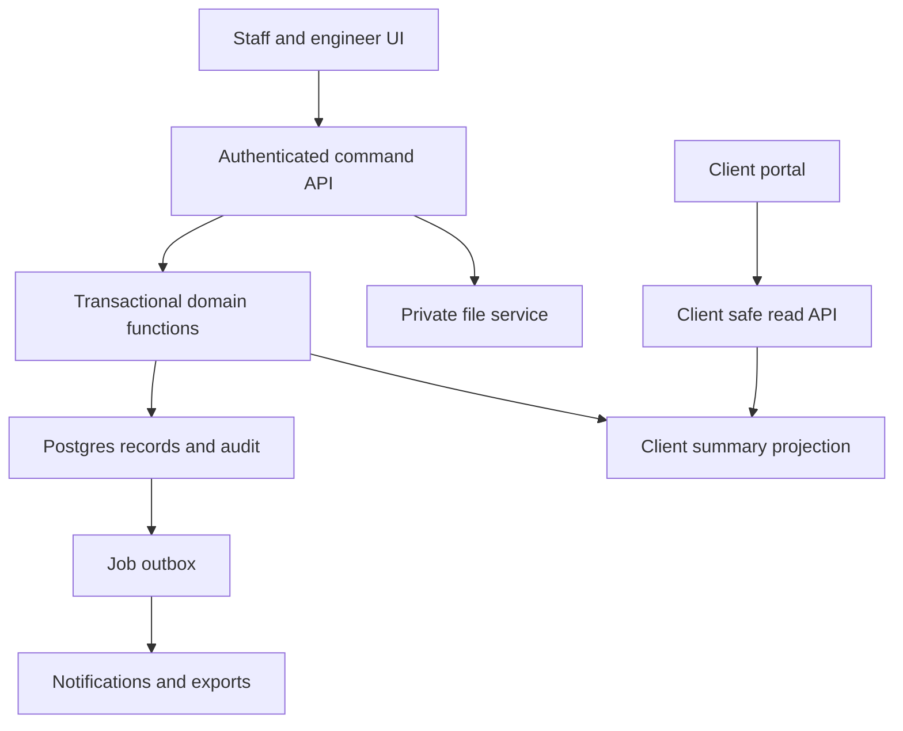

# Technical architecture

## Recommendation

Use a TypeScript modular monolith with a relational database. One responsive application serves staff, engineers and clients through different authorization-aware interfaces. This keeps a small team's operational burden manageable while preserving strong tenant boundaries. Do not introduce Kubernetes, microservices, a separate native app, a general workflow engine or an event-streaming platform in the MVP.

| Layer | Proposed choice | Reason and boundary |
| --- | --- | --- |
| Web | Next.js App Router, React, strict TypeScript | SSR where useful; phone capture remains interactive |
| Styling | Tailwind CSS and accessible React primitives | Logical properties and reviewed RTL behaviour |
| Localization | next-intl, ICU messages, Intl formatting | Complete Arabic and English copy |
| Charts | Recharts with safe aggregate DTOs | Responsive bars/lines; no raw client ledger |
| Validation | Zod and generated TypeScript contracts | Validate server inputs, not browser alone |
| Database | Supabase Postgres with SQL migrations | Constraints, locks, exact money and RLS |
| Auth | Supabase Auth with secure SSR session integration | Invites, recovery, optional later SSO |
| Files | Private Supabase Storage buckets | Metadata authorization and short-lived delivery |
| Offline | IndexedDB through a small versioned adapter | Explicit outbox and local attachment drafts |
| Tests | Vitest, Playwright, pgTAP | Domain, UI, RLS and database invariants |
| Delivery | GitHub Actions, separate preview/staging/production | Reproducible checks and controlled promotion |
| Hosting | Managed Node-compatible deployment, provider decided in Phase 0 | Do not assume a free tier supports commercial production |
| Jobs | Database outbox plus bounded worker/cron adapter | Email, cleanup, export and webhook retry |

These are recommendations, not deployed services. Phase 0 records exact compatible versions and licenses in an ADR and lockfile. Avoid a second ORM in the first release: author SQL migrations explicitly and generate database types. Standard Postgres tables and portable storage adapters limit lock-in.

## Boundaries and data flow



The browser may authenticate using the public SDK key, which is not a secret. Database and storage authorization remain mandatory. Ordinary server requests use the user's verified session/JWT, not a service-role key. Service credentials are restricted to separately reviewed background operations, with explicit organization scope and audit.

## Domain modules

`identity` owns organizations, invitations, membership and project grants. `projects` owns settings, categories and parties. `finance` owns costs, receipts, fees, budgets and approval. `progress` owns stage plans and published progress. `media` owns uploads, scans and file authorization. `portal` owns safe client projections. `imports` owns staged mapping and reconciliation. `billing` owns SaaS subscription entitlements, separate from project money. `audit` owns append-only events. Modules share IDs and documented contracts, not arbitrary table writes.

## Read models

Staff reads use user-scoped RLS and narrowly selected fields. Client reads use a dedicated `client_project_summaries` row plus published stage and update DTOs. A client never receives staff tables, supplier contacts, private descriptions or receipt storage paths.

Financial command functions lock `project_financial_state`, apply the mutation, compute authoritative aggregates, increment the revision, update the safe client summary and insert audit/outbox events in one transaction. This makes client and staff totals consistent. Scale later with measured optimizations; do not accept eventual inconsistency in financial totals just to add a queue early.

Stage publication updates the safe progress projection in its own transaction and increments a separate progress revision. The dashboard exposes both revision/freshness timestamps, so a fresh finance update cannot imply fresh site progress.

## Write models

All financial writes use dedicated command functions. Direct table INSERT/UPDATE/DELETE privileges for financial data are revoked from anonymous and authenticated roles; authenticated execution is granted only to the required RPC entry points. Each entry point rechecks actor identity, active membership, project assignment, role, organization match and state/version. Where privileged SQL is necessary, use tightly scoped SECURITY DEFINER functions with a fixed/empty search path, schema-qualified names, no dynamic SQL and explicit execute grants. They must not trust caller-supplied actor IDs.

Simple nonfinancial writes may use similarly controlled functions for consistency. RLS remains enabled for exposed tables; views must be security-invoker or inaccessible to client roles. A database owner can bypass ordinary controls, so managed operations credentials are a separate privileged surface, not an application role.

## Repository structure to implement

Use a single application repository initially. Create the following directories as their phases need them:

```text
app/                       localized routes and server entry points
src/components/            reusable accessible presentation
src/modules/               identity finance progress portal imports billing
src/lib/                   auth db localization validation files logging
src/offline/               IndexedDB schema outbox and sync controller
messages/                  ar.json and en.json
supabase/migrations/       schema constraints policies and functions
supabase/tests/            pgTAP allow deny and transaction tests
tests/unit/                domain fixtures and pure functions
tests/integration/         API authorization and command behaviour
tests/e2e/                 staff client Arabic mobile and offline journeys
tests/fixtures/            synthetic only
public/                    approved static icons and manifest assets
docs/adr/                  architecture decisions
docs/runbooks/             deploy restore incident migration procedures
```

This is a file layout, not a required monorepo. Keep business logic out of page components. The financial reference checker in this handoff is not copied unchanged into production; implement and cross-check a production domain library and database calculation against the same cases.

## Cache and synchronization policy

Authenticated portal and staff API responses use private/no-store caching unless a reviewed tenant-and-user-scoped cache is implemented. Never cache by project ID alone. No CDN shared caching of signed-in financial pages. Invalidate projections in the same transaction as the mutation, then revalidate the UI on successful command completion.

The service worker caches versioned static assets and an offline shell only. It must not indiscriminately cache API responses, authenticated HTML, signed file URLs or receipt images. Device drafts live in a user/organization-scoped IndexedDB store. Realtime updates are optional convenience, not a prerequisite for accurate totals; polling/refetch and revision checks must work without them.

## Initial nonfunctional targets

These are targets to test under a documented dataset and network profile, not a service-level promise: mobile LCP at or below 2.5 seconds at the 75th percentile under a representative pilot connection; authenticated non-upload reads below 500ms p95 and mutations below 1 second p95 under pilot load; project summary responsive with 10000 costs; no horizontal overflow at 360px client width; zero known critical cross-tenant or financial defects at launch.

Test against two organizations, several roles, at least 20 projects and realistic attachment counts. Set upload and query limits rather than accepting unlimited payloads. Monitor per-route latency, errors, outbox backlog, storage growth and financial projection reconciliation. Measure before adding Redis or more infrastructure.
