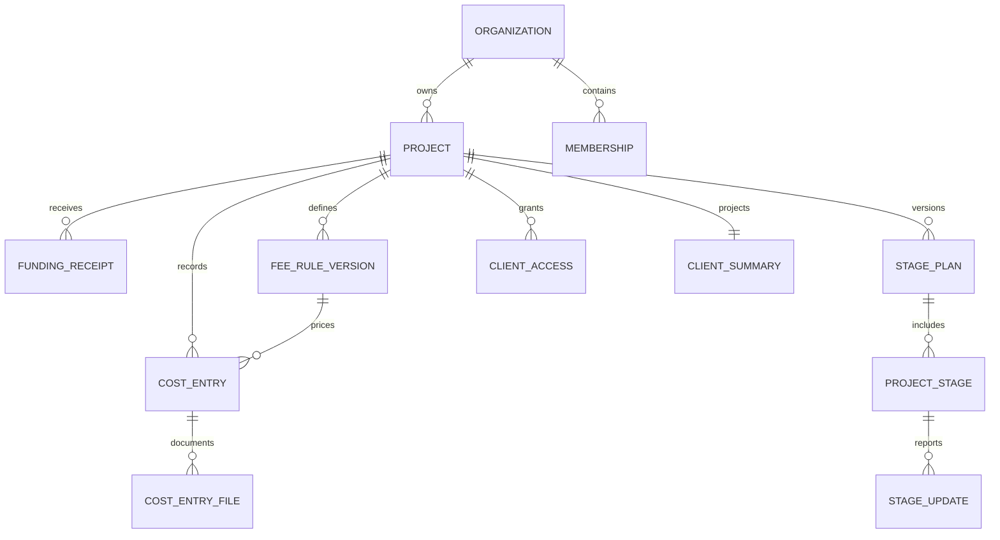
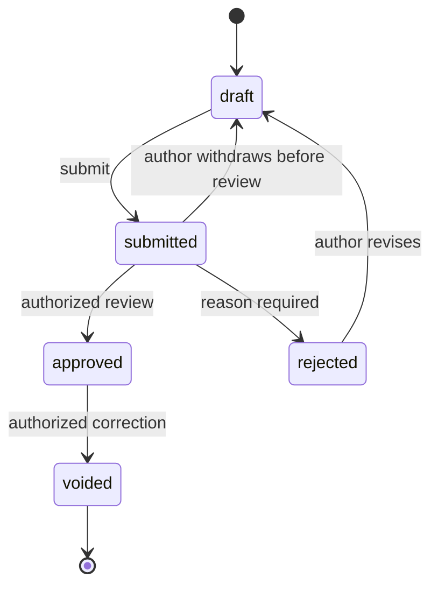

# Data model and state transitions

## Global conventions

Use UUID primary keys. Every tenant-owned table contains `organization_id`; every project-owned table also contains `project_id`. A globally unique UUID alone does not enforce tenancy. Create unique parent keys `(organization_id, id)` and composite foreign keys from children. Where necessary add `(organization_id, project_id, id)` uniqueness to enforce same-project references for refunds, categories, attachments and allocations.

Common mutable columns: `created_at`, `created_by`, `updated_at`, `version` integer. Derive created_by from authenticated identity. Use database defaults/triggers for audit timestamps. Soft archive project/configuration entities; do not overload `deleted_at` as permission logic. Financial records have explicit lifecycle states. Null is valid only where the contract defines an unknown value.

## Identity and project entities

| Entity | Important fields | Constraints |
| --- | --- | --- |
| organizations | name, default_locale, timezone, logo_file_id, accent_color, status | Approved tenant logo reference; no user-controlled executable theme |
| profiles | auth_user_id, display_name, preferred_locale | Minimal global identity; private contact access |
| organization_memberships | organization_id, user_id, role, status | Unique organization/user; roles owner, finance, manager, engineer |
| invitations | organization_id, project_id nullable, invited_email, intended_role, token_hash, expires_at, consumed_at | Token single-use; owner creates staff invites; token stored hashed |
| projects | organization_id, code, display_name, currency, timezone, status, current_fee_rule_id, current_budget_version_id, current_stage_plan_id | Unique code per organization; currency locked after first approval |
| project_staff_assignments | organization_id, project_id, user_id, active | User must have active organization membership |
| project_client_access | organization_id, project_id, user_id, status, invited_by | Separate from staff membership; revoke checked on every request |
| categories | organization_id, name_ar, name_en nullable, color_group, archived_at | Stable IDs; originals preserved; referenced categories cannot hard-delete |
| project_categories | organization_id, project_id, category_id, display_order | Explicit allowed categories per project |
| parties | organization_id, display_name, kind, contact_fields nullable | Supplier/contractor directory is optional, staff-only |

Owner has organization-wide access. Other staff require an active project assignment. An organization member does not automatically gain access to all project content. Clients can have grants to projects in several organizations without becoming internal staff in any of them.

## Financial entities

| Entity | Important fields | Constraints |
| --- | --- | --- |
| fee_rule_versions | organization_id, project_id, version_no, rate_bps, company_eligible, direct_eligible, starts_at, approved_by | Immutable after use; rate 0..10000 in MVP; no overlapping mutable rule |
| cost_entries | organization_id, project_id, payer, kind, amount_minor, currency, occurred_on nullable, description, category_id, party_id nullable, fee_eligible, proposed_fee_rule_id, fee_rule_version_id nullable before approval, status, submitted_by, approved_by, approved_at, refund_of_id, supersedes_id, missing_receipt_reason, origin | Amount positive; payer/kind enums; refund linkage; same-project composite FKs; version check |
| funding_receipts | organization_id, project_id, kind receipt/return, amount_minor, currency, occurred_on nullable, status, return_of_id, reference, approval fields | Positive magnitude; returns bounded by original net availability |
| fee_withdrawals | organization_id, project_id, kind withdrawal/return, amount_minor, currency, occurred_on, status, return_of_id, note, approval fields | Separate from cost entries; over-withdrawal flagged and owner-reason required |
| project_financial_state | organization_id, project_id, revision, funding_history_complete, cost_history_complete, fee_withdrawals_complete, completeness_attested_by, completeness_attested_at | One per project; financial command lock target; default completeness false |
| budget_versions | organization_id, project_id, version_no, status, total_minor, basis, approved_at/by | Basis fixed to cost_base_excluding_management_fee in MVP; immutable when approved |
| budget_items | organization_id, project_id, budget_version_id, category_id nullable, amount_minor, is_unallocated | Nonnegative; null category only for explicit unallocated line; items sum to total at approval |
| estimates | organization_id, project_id, category_id, amount_minor, payer, fee_eligible, description, status draft/active/converted/cancelled | Never counted in actuals; converted record references commitment |
| commitments | organization_id, project_id, party_id, category_id, agreed_minor, payer, status, source_estimate_id nullable, version | Approval required; change through variation/version, no hidden overwrite |
| commitment_allocations | organization_id, project_id, commitment_id, cost_entry_id, amount_minor, effect settle/reopen | Constraints and locks prevent over-allocation; refunds require explicit settlement policy |

Use foreign keys to projects for currency validation or enforce a project-currency trigger because CHECK constraints cannot safely query other rows. Cost approval locks and validates category/project relationships. A draft may propose fee eligibility; reviewer approval snapshots it. Preserve source fee eligibility separately from normalized interpretation during import.

## Progress and client presentation entities

| Entity | Important fields | Constraints |
| --- | --- | --- |
| stage_templates | organization_id nullable, name, version, stage_definitions | System templates copied into projects, never live-linked |
| stage_plans | organization_id, project_id, version_no, status, approved_by/at | Approved plans immutable; current project pointer changes transactionally |
| project_stages | organization_id, project_id, stage_plan_id, stable_stage_key, name, order, weight_bps nullable, included_in_progress, exclusion_reason nullable, planned_start/end, assigned_user_id | Plan dates ordered when present; unique order and stable_stage_key per plan; weights checked at plan approval |
| stage_updates | organization_id, project_id, stable_stage_key, stage_plan_id, status, progress_bps nullable, actual_start/end, note, review_state, submitted_by, published_by/at, supersedes_update_id nullable | Published update immutable; new correction supersedes; 0..10000 progress and status consistency |
| site_updates | organization_id, project_id, title, body, occurred_on, state draft/submitted/published/withdrawn, author, published_by/at | Client-safe narrative selected by reviewer; no automatic publication |
| files | organization_id, project_id nullable, storage_key, media_type, byte_size, sha256, purpose, upload_state, scan_state, created_by, retained_until | Opaque path; private bucket; upload_state pending/ready/failed/removed |
| cost_entry_files | organization_id, project_id, cost_entry_id, file_id | Same project; receipt purpose; staff-only |
| site_update_files | organization_id, project_id, site_update_id, file_id, caption, display_order, client_approved | Client access only when parent published and file ready/clean |
| client_project_summaries | organization_id, project_id, financial_revision, progress_revision, calculated_at, approved_financial_payload, published_progress_payload | Server-written safe projection; no vendor/receipt/private-note fields |

Organization logo files have project_id null and a separate authorization path; do not weaken project-file RLS to support them. Logo metadata must belong to the same organization. Stage plan revisions map unchanged stage keys to prior published history; removed/skipped stages require explicit owner review and weight redistribution. Excluded stages have included_in_progress false, a mandatory reason and weight zero; the portal derives a skipped label from the approved plan. Included-stage weights are either all null or all specified and sum to 10000. Stage updates reference the composite plan/stable-stage key, never a different project's matching key. Do not change historic update weights in place.

## Workflow and operations entities

| Entity | Important fields | Constraints |
| --- | --- | --- |
| command_receipts | organization_id, actor_id, idempotency_key, command_type, payload_hash, result_ref, committed_at | Unique org/actor/key; mismatch returns conflict; finance keys retained with records |
| audit_events | organization_id, project_id nullable, actor_id, action, entity_type/id, before/after or delta, reason, request_id, created_at | Append-only to app roles; sensitive content redacted from operational logs |
| import_batches | organization_id, project_id, file_id, source_fingerprint, status, mapping_version, counts, reconciled_totals, approved_by/at | Dry-run then explicit commit; original source preserved privately |
| import_rows | organization_id, project_id, batch_id, source_row_key, raw_values, normalized_payload, validation_flags, target_record_id | Source row uniqueness across reimports; raw fields staff-only |
| outbox_events | organization_id, project_id nullable, type, payload_ref, attempts, available_at, processed_at | Transactional enqueue; deduplicated worker delivery |
| subscriptions | organization_id, provider, provider_customer_id, status, period_end, plan_key | SaaS billing only; no project money |
| entitlement_overrides | organization_id, limits, expires_at, reason, granted_by | Audited manual pilot access; no production hardcoded bypass |
| billing_webhook_events | provider, provider_event_id, received_at, processed_at, payload_hash | Globally unique provider/event, signatures verified |

Do not implement all P1 tables and UIs up front. Create required P0 entities first; reserve names and semantics for later modules. Log retention, export jobs and support-access grants may be added with their runbooks in hardening phases.

## P1 extensions and lifecycle contracts

`change_requests` contain organization/project, version, title, scope text, cost_base_delta_minor, estimated_fee_delta_minor, schedule_delta_days nullable, proposed_budget_version_id nullable, state, author and a content hash. States are draft, awaiting_client, client_accepted, client_declined, applied and withdrawn. A sent version is immutable; editing creates a new version and invalidates outstanding decisions. `change_decisions` store request/version/hash, authenticated client actor, decision, timestamp and optional comment. The designated client approver is an explicit project grant capability, off by default; ordinary client viewers cannot decide.

Client acceptance records a business approval, not a claim of legally sufficient e-signature. It does not create paid costs or funding. Owner applies an accepted request by approving its associated budget/commitment/stage-plan changes in a checked transaction and marks it applied. Applying the same version twice is prohibited. Declined or withdrawn changes have no financial effect. Multiple authorized client viewers do not silently become unanimous approvers; MVP P1 uses one designated approver per request.

`funding_requests` contain organization/project, requested_minor, currency, reason, requested_by, issued_at, due_on nullable and state draft/issued/cancelled/closed. They create no financial receipt; actual funding is recorded separately and optionally allocated. `snag_items` contain organization/project, stable_stage_key nullable, title, description, assignee, due_on, priority, state open/in_progress/resolved/verified and evidence links. Only manager/owner verifies closure. Neither entity changes financial actuals or physical progress automatically.

P1 API additions follow the same authorization/idempotency rules: POST `.../change-requests`, POST `.../change-requests/id/send`, POST `/portal/projects/P/change-requests/id/decide`, POST `.../change-requests/id/apply`, POST `.../funding-requests`, and POST/PATCH `.../snag-items`. Each requires full OpenAPI validation and role tests when implemented. Acceptance must cover stale-version client decisions, unauthorized approvers, double-apply, decline with no financial effect and funding requests that do not become receipts.

## Relationships

The diagram is conceptual. Composite keys and stable stage keys described above are authoritative; do not infer simple foreign keys from the diagram alone.

## Financial state machine

Approval stores reviewer and fee rule. Editing a submitted record requires withdrawal; version conflict prevents overwriting a concurrent review. Hard deletion is limited to never-submitted drafts and audited. Approved and voided records remain. Rejection does not erase receipts or the reason. Owner-approved import uses the same approval invariants with explicit import metadata.

## Index and retention starting points

Index `(organization_id, project_id, status, occurred_on)`, membership user/org/status, project grants user/project/status, category/project, source fingerprint/row key, outbox available_at/processed_at, and audit project/created_at. Add refund_of and allocation indexes for lock-time checks. Paginate tables by stable keyset `(created_at,id)` and never load all attachments in a project listing. Confirm query plans before extra indexes.

Retention is a configurable operational policy approved before production. Until then, do not auto-delete financial history or source files. Pending orphan uploads can expire under the documented cleanup policy, but submitted evidence cannot be silently removed.
