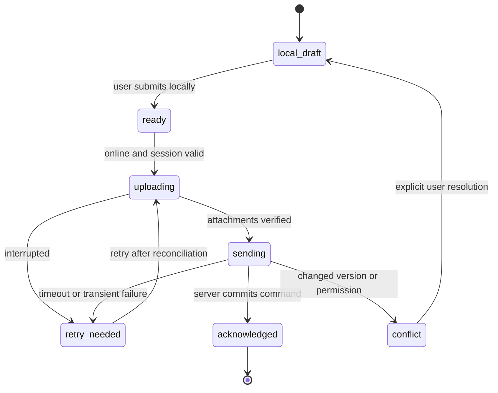

# Mobile and offline specification

## Product contract

MVP mobile means a responsive installable PWA tested on actual Android Chrome and iPhone Safari. It is not a native App Store application. Camera/file selection and home-screen installation must work on supported devices; if an API is unavailable, offer a normal file picker and clear instructions. Do not promise continuous background work, reliable push on every device or offline access after local storage is evicted.

Offline scope is deliberately limited: create/edit local cost drafts and site-update drafts, attach local photographs, view minimal cached project/category choices and retry submission when the app is open and connected. No offline approvals, funding transfers, fee-rule changes, client publication, membership changes or authoritative financial dashboard. Clients require an online session for financial data.

## Outbox record

Store schema version, authenticated user ID, organization/project IDs, client record UUID, command UUID, command type, canonical payload, payload hash, expected server version if applicable, attachment references, state, retry count, last error, created/updated times and last server acknowledgment. Blob storage references are local IndexedDB keys, not public URLs. Do not store service keys or refresh tokens in the draft payload.

An item may already exist on the server when the device receives a timeout. On retry, first reconcile using the durable command/client record IDs; reuse the original idempotency key. Never generate a new key just because the network response was lost.

## Sync sequence

1. User enters a draft. Save locally after every meaningful field change and show “Saved on this device”. Catch quota and serialization errors visibly.
2. When user submits, validate locally but retain the draft. If offline, show “Waiting to send” and the number of queued attachments.
3. When the app is open with connectivity, verify the current session and same user/org scope. A reconnect event is only a hint; the server request determines connectivity.
4. Revalidate current project access and category/rule availability. Do not silently change an archived category or payer.
5. Prepare and upload each attachment with bounded concurrency, checksum and progress. Reuse completed uploads when still authorized. Refresh expired tickets without duplicating the final registered file.
6. Send the cost/site-update command with its original idempotency key. A financial draft can be created before files finish, but submit remains blocked until required files are ready or an explicit missing-receipt exception is accepted.
7. Persist acknowledgment before deleting any local data. Show “Submitted for review” with the server record ID; this is not “Approved”.
8. After confirmation, purge local attachment blobs promptly under the device retention policy. Retain a minimal non-sensitive acknowledgment to prevent accidental duplicate resend.

## Conflict and failure handling

| Situation | Required behaviour |
| --- | --- |
| App closes during upload | Keep draft; resume/reconcile on next foreground session |
| Duplicate tap | Disable immediate double submission and enforce server idempotency |
| Browser lacks background sync | Foreground and manual retry remain fully functional |
| Session expires | Pause; reauthenticate; do not discard drafts |
| Different user signs in | Do not show or send previous user's drafts |
| Project access revoked | Stop sync; no retries using another user's credentials |
| Server draft changed | Show conflict with permitted fields; no last-write-wins |
| Cost already approved elsewhere | Draft cannot overwrite it; offer reviewed correction request |
| Storage quota exceeded | Clear warning; allow smaller files or online save; no false success |
| Offline device storage evicted | Explain recovery is not guaranteed; no invented record |
| Category archived after draft | Ask user to select a current category, retaining original text |
| Upload rejected or scan fails | Quarantine and actionable error; no client publication |

Backoff is exponential with jitter and a cap, respecting Retry-After. Permanent 403/422/409 errors need user action, not endless retries. Batch sync is capped, proposed 20 commands; return per-command results. Partial batch success is allowed and explicit. A single financial command is always atomic.

## Device privacy

Show a short notice that offline drafts and photos are temporarily stored on this device and may be visible to anyone using its unlocked browser profile. Do not call this end-to-end encryption. Browser origin isolation is not protection from a shared unlocked device. Offer “Clear local drafts” and an opt-out of attachment caching for shared phones.

On logout, warn about unsynced drafts and offer sync now, cancel logout, or explicitly discard local drafts. Security-driven session revocation blocks access and sync even if local draft bytes remain until cleanup; the app cannot remotely guarantee deletion from an offline browser. Set a proposed seven-day draft expiry with warnings, and do not silently delete unsubmitted work without prior disclosure. Purge acknowledged attachment bytes promptly.

## Device acceptance

Test real or clearly identified simulated iPhone Safari and Android Chrome separately; emulation alone does not prove camera/install behaviour. Cases: fresh install, add-to-home-screen, portrait landscape, camera denial, no network, weak network, app kill/reopen, token expiry, upload retry, 10 drafts queued, mixed Arabic/English input, Arabic digits, oversized image, unsupported HEIC and device storage failure. Publish a supported-device/browser matrix based on tests, not assumptions.
