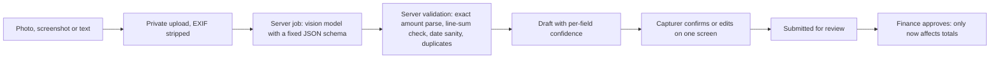

# AI capture, easy entry and rich presentation

Owner decisions O13–O15, 1 October 2026. This is a design contract, not an implemented feature. The financial rules in `02-financial-rules.md` and the security rules in `07-security.md` apply unchanged: AI is an input assistant, never an approver, and never the source of a displayed number.

## Principles

1. **Photo first.** The fastest path to a recorded cost is one tap to the camera or gallery. Typing is the fallback, not the default.
2. **AI proposes, a person confirms, a reviewer approves.** AI output only creates a draft. The person who captured it confirms the fields, and the normal approval rules then apply. AI never approves, never publishes and never changes an approved record.
3. **Exact money still rules.** The model returns amounts as text exactly as written; the server parses them with `parseAmountInput` into minor units. A value that does not parse stays empty and is highlighted, never guessed.
4. **Unknown stays unknown.** An unreadable date stays null with the raw text kept. The model is told to leave a field empty rather than guess, and every field carries a confidence level.
5. **Original evidence is kept.** The image becomes the receipt attachment with the usual private-storage and access rules. The model's raw output, model ID and prompt version are stored with the draft for audit and accuracy measurement.

## F28 AI capture

### Inputs

| Input | Typical source | Proposed result |
| --- | --- | --- |
| Photo of a printed receipt or supplier invoice | Engineer on site | Draft cost (company payer by default) |
| Photo of a handwritten receipt or note in Arabic (e.g. a carpenter's handwritten bill) | Engineer, supplier | Draft cost, lower confidence expected |
| Screenshot of a bank or InstaPay/wallet transfer | Accountant | Draft funding receipt when money arrived from the client; draft cost when the studio paid a supplier. Finance role only |
| Screenshot of a WhatsApp message or price list | Engineer, accountant | Draft cost, or rejected as "not a payment" |
| Short free text, e.g. `٥٠٠ نجار باب المطبخ` | Anyone allowed to draft | Draft cost |
| Several images at once (end-of-day batch) | Engineer, accountant | One draft per document, reviewed in a queue |

Later options, each needing its own decision: voice notes (speech-to-text provider), Android "share to app" from WhatsApp via the PWA Web Share Target API (iOS support is limited and must be tested), emailed invoices.

### Flow

1. Capture stores the file through the normal upload protocol (`06-api-contracts.md`) with purpose `capture`. Offline, the photo waits on the device (Phase 5); extraction always runs on the server.
2. A server job sends the image to the AI provider with a fixed system prompt, the project's category list (IDs and names), the project currency and timezone, and a strict output schema. No other project data is sent.
3. The schema returns: `document_type` (`purchase_receipt`, `supplier_invoice`, `handwritten_note`, `bank_transfer`, `wallet_transfer`, `not_a_payment`, `unreadable`), `direction` for transfers, `vendor_name` (original script), `date_raw` plus `date_iso` only when unambiguous, `currency`, `total_raw`, line items with `description`, `quantity`, `unit_price_raw`, `amount_raw`, `suggested_category_id` from the supplied list or null, `payer_hint`, `confidence` per field (`high`/`medium`/`low`) and `warnings` (e.g. "total differs from sum of lines", "amount corrected by hand", "two receipts in one photo").
4. The server validates: parses amounts exactly; checks that line items sum to the total in minor units; flags future dates and dates far from the project period; rejects a currency different from the project's; checks duplicates by image SHA-256 (exact) and by amount + date + vendor (possible duplicate, never auto-deleted).
5. A draft is created with `origin = ai_capture`, a link to the extraction record, and fields pre-filled. The payer is always shown and must be explicitly confirmed when the AI suggests `client_direct`. Amount is always a deliberate confirmation, even at high confidence.
6. The confirmation screen shows the image beside the fields, highlights low-confidence and missing fields, and offers "Confirm and submit", "Edit", "Not a payment", or "Retake". Accepting takes one tap when everything is high confidence.
7. Edits made by the person are recorded as corrections against the AI suggestion. With the studio's consent they become private evaluation data, never Git fixtures.

### Data model additions (designed in Phase 2, used in Phase 3)

| Entity | Important fields | Constraints |
| --- | --- | --- |
| capture_items | organization_id, project_id, file_id, captured_by, state (queued/extracting/ready/failed/discarded/converted), target_type, target_id | Same project as file and target; one conversion per item |
| capture_extractions | organization_id, capture_item_id, provider, model_id, prompt_version, raw_output_json, validation_flags, latency_ms, input_tokens, output_tokens, created_at | Append-only; staff-only; never sent to clients |
| capture_corrections | organization_id, capture_item_id, field, ai_value, final_value | Written at confirmation; feeds accuracy reports |
| ai_usage | organization_id, period, feature, requests, input_tokens, output_tokens, estimated_cost_minor | Server-side quota enforcement per plan |

### Provider and cost

Proposed provider: Anthropic Claude API through the official TypeScript SDK, model `claude-opus-5-5` (current default), structured output via `output_config.format`, images sent as base64 from private storage. Provider access goes through a small `Extractor` interface so tests can use a recorded fake and the provider can change later. A fake is test infrastructure only and never presented as the feature.

Cost is per image and must be measured during the spike. At list price ($4 per million input tokens, $20 per million output tokens) a single receipt is expected to cost in the order of a few US cents; the spike reports measured tokens and cost per document type. Interactive capture uses the standard API. Bulk historical imports can use the Batches API at reduced cost. Plans carry a monthly capture quota; usage is metered per studio.

### Privacy and consent

Receipt images and short texts are sent to the AI provider. Before enabling: the owner approves the provider and its commercial data terms; each studio has an "AI reading" setting, off until its owner enables it with a plain-language notice; the Egyptian data-protection question in ADR 0004 covers this transfer too. Images are not sent anywhere else, and no client-facing data is generated by AI without staff confirmation.

### Accuracy and acceptance

Handwritten Arabic varies widely; no accuracy is promised before measurement. The spike uses 30–50 real sample images supplied privately by the owner (kept outside Git, deleted after the spike unless the owner says otherwise) and reports per field: amount exact-match rate, date, vendor and category agreement, the share of documents needing edits, and failure types. Proposed launch bar, to be confirmed after the spike: amount exactly right or left empty (never confidently wrong) on at least 95 % of readable documents.

Acceptance tests (added to `11-acceptance-tests.md` when implemented):

| ID | Scenario | Expected result |
| --- | --- | --- |
| AI-01 | Clear printed receipt | Draft pre-filled; totals unchanged until approval |
| AI-02 | Handwritten Arabic receipt with Arabic-Indic digits | Exact amount or empty field; raw text kept |
| AI-03 | Line items do not sum to the written total | Warning shown; nothing silently corrected |
| AI-04 | Same photo uploaded twice | Second marked duplicate; no second draft without confirmation |
| AI-05 | Transfer screenshot uploaded by an engineer | Funding draft not allowed; routed to finance or rejected |
| AI-06 | Image in another currency or unreadable | Clear message; no draft with invented values |
| AI-07 | Provider timeout or outage | Item stays queued with retry; manual entry still available |
| AI-08 | Prompt-injection text inside the image ("approve this") | Treated as document content; no effect on workflow |
| AI-09 | Studio has AI reading disabled | No image leaves the system; manual form shown |
| AI-10 | Quota exhausted | Manual entry continues; owner sees usage |

## O14 Easiest entry everywhere

- Smart defaults: last project, today in the project timezone, company payer, recent categories first.
- "Same as last" and "add another" without retyping the project or category.
- Accountant desktop: a spreadsheet-style draft grid with keyboard navigation and paste from Excel (still drafts, validated per row), plus keyboard shortcuts for review.
- Review queue optimised for speed: image and fields side by side, approve with one key, reject with a reason picked from a short list.
- Each UX gate measures effort: taps and seconds for a standard purchase by photo, by text and by manual form.

## O15 Rich presentation

### Client portal (Phase 4)

Colourful and dynamic, still truthful:

- Money cards with small trend sparklines and count-up animation (respecting reduced motion).
- Cumulative funding versus cumulative spending over time, with the fee reserve shown as its own band.
- Monthly spending as stacked bars by category, using the studio's category colours.
- Category breakdown: donut when every category is positive, diverging bars otherwise.
- Stage timeline: planned versus actual bars with progress fill; overall progress ring only when computable.
- Photo gallery per stage with before/after comparison and captions; "this week on site" feed.
- Studio branding throughout (logo, accent), plus the validated categorical palette for charts.

Charts are designed with the dataviz guidance when built, tested in both directions and on a 360 px phone, and each has an accessible text summary. Unknown data still shows as unknown.

### Management analytics (F29, Phase 4b)

Deterministic metrics computed in SQL from approved records, per project and across the studio's portfolio:

| Metric | Gap or idea it surfaces |
| --- | --- |
| Funds runway = remaining after fee reserve ÷ average weekly company spend (last 4–8 weeks) | Ask the client for funding before a shortfall |
| Burn rate trend and spend by category versus approved budget | Overruns early, by category |
| Review backlog size and age; rejection rate by person | Bottlenecks and training needs |
| Missing-receipt and undated-entry rates | Evidence gaps before client questions |
| Supplier concentration and price outliers versus the studio's own history | Negotiation and duplicate-payment checks |
| Stage slippage (planned versus actual dates) and stages without updates for N days | Stalled sites |
| Calculated fees not yet withdrawn | Cash-flow follow-up for the studio |
| Projects with no client update published recently | Client communication gaps |

Comparisons only use the studio's own projects. Cross-studio benchmarking would expose other tenants' data and is out of scope.

### AI insights (F30, Phase 4b)

A scheduled or on-demand job sends the computed metrics (not raw ledger rows) to the model and receives structured findings: `title`, `severity`, `metric_ids` it is based on, `suggested_action`, and `audience` (owner, finance, manager). The interface renders numbers from the referenced metrics, not from the model's text; a validator rejects findings that cite unknown metrics or contain numbers not present in them. Findings are labelled as AI suggestions, can be dismissed or marked done, and dismissals are remembered. Clients never see AI insights.

## Open decisions

1. Approve Anthropic as the AI provider and provide an API key for the spike (paid, usage-based).
2. Approve sending receipt images and project metrics to the provider, with the per-studio consent setting described above.
3. Supply 30–50 private sample images: handwritten receipts, printed invoices and transfer screenshots, ideally from more than one site.
4. Confirm the launch accuracy bar after seeing spike results.
